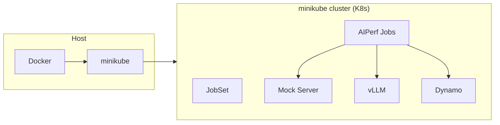
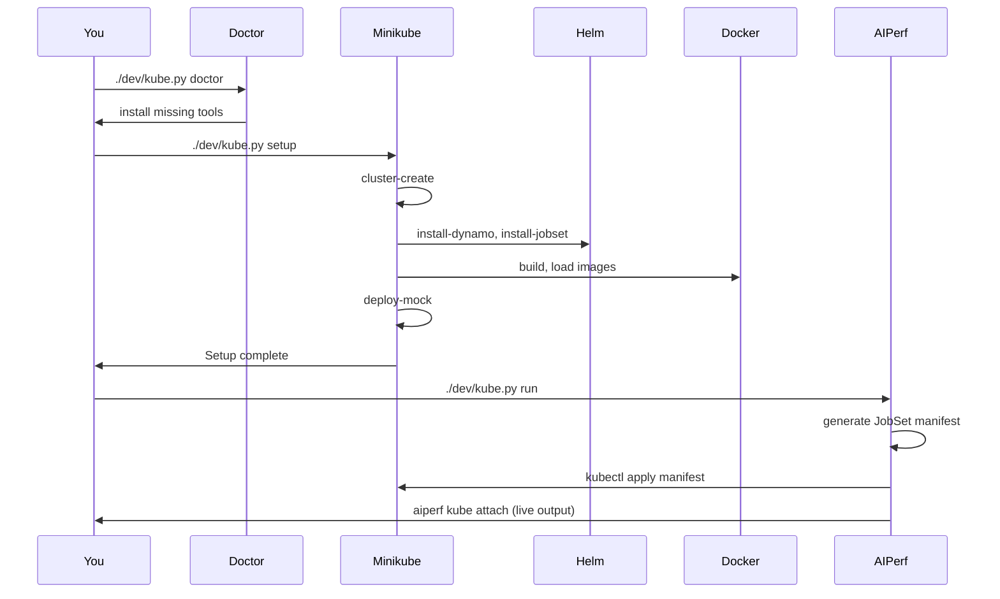

# AIPerf Minikube Development Suite

```
       ░▒▓ █▀█ █ █▀█ █▀▀ █▀█ █▀▀ ▓▒░
    ░░▒▒▓▓ █▀█ █ █▀▀ ██▄ █▀▄ █▀  ▓▓▒▒░░

         From prefill to production.
 Minikube · Docker · GPU · Mock · vLLM · Dynamo
```

Python CLI (`kube.py`) for building and running AIPerf in a local **minikube** cluster. Handles cluster lifecycle, image building, and server deployment. Benchmarks are deployed via AIPerf's Kubernetes runner and managed with `aiperf kube` commands. Run directly from the project root.

---

## Quick start (copy-paste)

From the **project root**:

```bash
# 1. Install anything missing (docker, minikube, kubectl, helm, k9s)
./dev/kube.py doctor

# 2. Full setup: cluster + Dynamo operator + JobSet + images + mock server
./dev/kube.py setup

# 3. Run a benchmark (attached)
./dev/kube.py run
```

Or in one line after doctor:

```bash
./dev/kube.py setup && ./dev/kube.py run
```

**Teardown when done:**

```bash
./dev/kube.py teardown
```

---

## Prerequisites

| Tool      | Purpose                          |
|-----------|----------------------------------|
| **Docker** | Container runtime (Docker Desktop on Mac) |
| **minikube** | Local Kubernetes cluster        |
| **kubectl** | Kubernetes CLI                  |
| **helm**  | Install Dynamo operator           |
| **uv**    | Run AIPerf CLI (`run` generates manifests and attaches via `aiperf kube`) |

**Optional:** **k9s** — terminal UI for the cluster (doctor can install it).

Run **`./dev/kube.py doctor`** to check what's installed and interactively install missing tools (with platform-specific recipes for macOS, Arch, Debian/Ubuntu, Fedora, and generic Linux).

---

## Architecture



**Setup pipeline:**



---

## Command reference

### Workflow

| Command                        | Description |
|--------------------------------|-------------|
| `./dev/kube.py doctor`         | Check prerequisites; interactively install missing tools (docker, minikube, kubectl, helm, k9s). |
| `./dev/kube.py setup`          | Full setup: cluster + Dynamo operator + JobSet + build images + load + deploy mock server. |
| `./dev/kube.py teardown`       | Delete entire minikube cluster. |
| `./dev/kube.py status`         | Show cluster status (GPU, Dynamo, vLLM, benchmarks, images). |
| `./dev/kube.py reload`         | Rebuild AIPerf image and load into minikube (fast iteration). |

### Inference servers

| Command                        | Description |
|--------------------------------|-------------|
| `./dev/kube.py deploy-mock`    | Deploy mock LLM server (no GPU). |
| `./dev/kube.py remove-mock`    | Remove mock server. |
| `./dev/kube.py deploy-vllm`    | Deploy standalone vLLM server (GPU). |
| `./dev/kube.py remove-vllm`    | Remove vLLM server. |
| `./dev/kube.py vllm-logs`      | View vLLM logs (`--follow` to stream). |
| `./dev/kube.py deploy-dynamo`  | Deploy Dynamo inference server (agg / disagg / disagg-1gpu). |
| `./dev/kube.py remove-dynamo`  | Remove Dynamo server. |
| `./dev/kube.py dynamo-logs`    | View Dynamo pod logs (`--follow` to stream). |
| `./dev/kube.py deploy-lora`    | Deploy LoRA adapter on running Dynamo base model. |
| `./dev/kube.py remove-lora`    | Remove LoRA adapter. |

### Benchmark (distributed — JobSet)

| Command                        | Description |
|--------------------------------|-------------|
| `./dev/kube.py run`            | Generate manifest, deploy benchmark, and attach via `aiperf kube attach`. |
| `./dev/kube.py run-detach`     | Generate manifest, deploy benchmark in background (prints job ID for follow-up). |
| `./dev/kube.py dry-run`        | Print generated benchmark manifest only (no apply). |

After `run-detach`, use the printed job ID with `aiperf kube` commands:

```bash
uv run aiperf kube status <job_id>    # check benchmark status
uv run aiperf kube logs <job_id>      # view benchmark logs
uv run aiperf kube attach <job_id>    # re-attach to running benchmark
uv run aiperf kube results <job_id>   # view results after completion
```

### Benchmark (single-pod — no JobSet)

| Command                             | Description |
|-------------------------------------|-------------|
| `./dev/kube.py run-local`           | Deploy single-pod benchmark and attach via `kubectl logs`. |
| `./dev/kube.py run-local-detach`    | Deploy single-pod benchmark in background. |
| `./dev/kube.py dry-run-local`       | Print single-pod manifest only (no apply). |

All 9 AIPerf services run as subprocesses in one container (MULTIPROCESSING mode, ZMQ IPC). No JobSet CRD required. Uses the same `--config` / `--workers` options as `run`.

### Low-level

| Command                           | Description |
|-----------------------------------|-------------|
| `./dev/kube.py cluster-create`    | Create minikube cluster only (GPU if nvidia-smi present). |
| `./dev/kube.py cluster-delete`    | Delete minikube cluster. |
| `./dev/kube.py install-dynamo`    | Install Dynamo operator (Helm from NGC). |
| `./dev/kube.py install-jobset`    | Install JobSet controller. |
| `./dev/kube.py build`             | Build AIPerf + mock Docker images. |
| `./dev/kube.py load`              | Load images into minikube. |
| `./dev/kube.py cleanup`           | Remove benchmark namespaces (keep cluster). |
| `./dev/kube.py logs`              | View AIPerf benchmark pod logs. |

---

## Options and variables

### Benchmark (all run / run-local variants)

| Flag                  | Default                                | Description |
|-----------------------|----------------------------------------|-------------|
| `--config` / `-c`    | `dev/deploy/test-benchmark-config.yaml` | Benchmark config file (path from project root). |
| `--workers` / `-w`   | `10`                                   | Number of workers. |

**Examples:**

```bash
./dev/kube.py run -c my.yaml -w 20       # distributed (JobSet)
./dev/kube.py run-local -w 5             # single-pod (no JobSet)
./dev/kube.py dry-run-local              # preview single-pod manifest
```

### Logs

| Flag                    | Default       | Description |
|-------------------------|---------------|-------------|
| `--namespace` / `-n`   | (auto-detect) | Namespace for `logs`. |
| `--pod` / `-p`         | `controller`  | Pod: `controller`, `worker-N`, or `all`. |
| `--follow` / `-f`      | false         | Stream logs. |

```bash
./dev/kube.py logs --follow
./dev/kube.py logs --pod all
./dev/kube.py vllm-logs --follow
```

### Cluster and images

| Variable              | Default              | Description |
|-----------------------|----------------------|-------------|
| `CLUSTER_NAME`        | `aiperf`             | Minikube profile name. |
| `AIPERF_IMAGE`        | `aiperf:local`       | AIPerf Docker image. |
| `MOCK_SERVER_IMAGE`   | `aiperf-mock-server:local` | Mock server image. |
| `JOBSET_VERSION`      | `v0.8.0`             | JobSet controller version. |
| `MINIKUBE_MEMORY`     | `16000mb`            | Minikube memory. |
| `MINIKUBE_CPUS`       | `8`                  | Minikube CPUs. |

### vLLM (deploy-vllm)

| Flag / variable                          | Default                      | Description |
|------------------------------------------|------------------------------|-------------|
| `--model` / `MODEL`                     | `Qwen/Qwen3-0.6B`            | Model name. |
| `--gpus` / `GPUS`                       | `1`                          | GPUs per instance. |
| `--vllm-image` / `VLLM_IMAGE`           | `vllm/vllm-openai:latest`    | vLLM image. |
| `--max-model-len` / `MAX_MODEL_LEN`     | `4096`                       | Max context length. |
| `GPU_MEM_UTIL`                           | `0.5`                        | GPU memory utilization (0–1). |
| `HF_TOKEN`                               | —                            | Hugging Face token (gated models). |

### Dynamo (deploy-dynamo)

| Flag / variable                                  | Default   | Description |
|--------------------------------------------------|-----------|-------------|
| `--mode` / `DYNAMO_MODE`                        | `agg`     | `agg`, `disagg`, or `disagg-1gpu`. |
| `--dynamo-image` / `DYNAMO_IMAGE`               | `nvcr.io/nvidia/ai-dynamo/vllm-runtime:0.9.0` | Dynamo runtime image. |
| `DYNAMO_VERSION`                                  | `0.9.0`   | Dynamo operator version. |
| `DYNAMO_1GPU_MEM_UTIL`                            | `0.3`     | GPU memory util for single-GPU disagg. |
| `--router-mode` / `DYNAMO_ROUTER_MODE`           | —         | e.g. `kv`, `round-robin`. |
| `--kvbm-cpu-cache-gb` / `DYNAMO_KVBM_CPU_CACHE_GB` | —      | KVBM CPU cache (GB). |
| `--connectors` / `DYNAMO_CONNECTORS`             | —         | e.g. `kvbm nixl`. |

### LoRA (deploy-lora / remove-lora)

| Flag                  | Description |
|-----------------------|-------------|
| `--name`              | LoRA adapter name. |
| `--base-model`        | Base model name. |
| `--source`            | LoRA source (e.g. `hf://org/repo`). |

### Doctor / platform

| Variable          | Description |
|-------------------|-------------|
| `PLATFORM`        | Override platform: `mac`, `arch`, `debian`, `fedora`, `linux`. |
| `ARCH`            | Override Linux binary arch: `amd64`, `arm64`. |
| `INSTALL_PREFIX`  | Linux install path for doctor-installed binaries (default `/usr/local`). |

---

## Workflows

### First-time setup (CPU + mock)

```bash
./dev/kube.py doctor   # install docker, minikube, kubectl, helm, (optional k9s)
./dev/kube.py setup    # cluster + Dynamo operator + JobSet + images + mock server
./dev/kube.py run      # run benchmark against mock server
```

### Single-pod benchmark (simplest, no JobSet)

```bash
./dev/kube.py doctor
./dev/kube.py setup
./dev/kube.py run-local              # all services in one pod, attach to logs
./dev/kube.py run-local -w 5         # fewer workers for resource-constrained clusters
```

`run-local` runs all AIPerf services as subprocesses in a single Kubernetes Job. No JobSet CRD required, faster startup, lower resource overhead. Good for quick iteration on minikube.

### GPU (vLLM)

```bash
./dev/kube.py doctor                           # ensure nvidia-smi + nvidia-ctk present
./dev/kube.py setup                            # same as above
./dev/kube.py deploy-vllm                      # deploy vLLM (default model, 1 GPU)
./dev/kube.py run -c my-gpu.yaml               # benchmark against vLLM
./dev/kube.py vllm-logs --follow
./dev/kube.py remove-vllm
```

Custom model:

```bash
./dev/kube.py deploy-vllm --model facebook/opt-125m --gpus 1
```

### Dynamo (aggregated / disaggregated)

```bash
./dev/kube.py setup
./dev/kube.py deploy-dynamo                            # aggregated (default)
./dev/kube.py deploy-dynamo --mode disagg              # disaggregated
./dev/kube.py deploy-dynamo --mode disagg-1gpu         # single-GPU disaggregated
./dev/kube.py run -c dev/deploy/dynamo-benchmark-config.yaml
./dev/kube.py dynamo-logs --follow
./dev/kube.py remove-dynamo
```

### LoRA on Dynamo

```bash
./dev/kube.py deploy-dynamo
./dev/kube.py deploy-lora --name my-lora --base-model Qwen/Qwen3-0.6B --source hf://org/repo
# run benchmark using LoRA endpoint
./dev/kube.py remove-lora --name my-lora
```

### Development iteration

```bash
# After code changes — rebuild, reload, and run:
./dev/kube.py reload && ./dev/kube.py run

# Single-pod (fastest iteration, no JobSet):
./dev/kube.py reload && ./dev/kube.py run-local

# Or run detached and monitor:
./dev/kube.py reload && ./dev/kube.py run-detach
uv run aiperf kube status <job_id>
uv run aiperf kube logs <job_id>
```

### Manage benchmarks (`aiperf kube`)

The `run` / `run-detach` commands use AIPerf's Kubernetes runner to generate and deploy JobSet manifests. After deployment, benchmark lifecycle is managed via `aiperf kube`:

```bash
uv run aiperf kube list                # list all benchmark jobs
uv run aiperf kube status <job_id>     # check status
uv run aiperf kube attach <job_id>     # attach to running benchmark
uv run aiperf kube logs <job_id>       # view logs
uv run aiperf kube results <job_id>    # view results
uv run aiperf kube cancel <job_id>     # cancel running benchmark
uv run aiperf kube delete <job_id>     # delete benchmark resources
```

### Cleanup

```bash
./dev/kube.py cleanup   # remove benchmark namespaces only
./dev/kube.py teardown  # delete entire minikube cluster
```

---

## Directory structure

```
dev/
├── kube.py            # CLI (all logic)
├── README.md          # This file
└── deploy/
    ├── Dockerfile.mock-server       # Mock server Docker image
    ├── mock-server.yaml             # Mock LLM server K8s manifest
    ├── test-benchmark-config.yaml   # Default benchmark config (mock)
    └── dynamo-benchmark-config.yaml # Dynamo benchmark config
```

Cluster is **minikube** with profile `CLUSTER_NAME` (default `aiperf`). The AIPerf image is built from the **project root** `Dockerfile` (`--target runtime`) and loaded into minikube's Docker.

---

## Troubleshooting

| Issue | What to do |
|-------|------------|
| Tools missing | `./dev/kube.py doctor` and accept installs. |
| Docker not running | Start Docker Desktop (Mac: `open -a Docker`; Linux: `sudo systemctl start docker` or see doctor hint). |
| Cluster won't start | `./dev/kube.py cluster-delete` then `./dev/kube.py setup` (or `./dev/kube.py cluster-create`). |
| Images not in cluster | `./dev/kube.py build && ./dev/kube.py load`. |
| Benchmark stuck | `uv run aiperf kube status <job_id>`, `uv run aiperf kube logs <job_id>`, then `uv run aiperf kube cancel <job_id>` or `./dev/kube.py cleanup` and retry. |
| Need full reset | `./dev/kube.py teardown` then `./dev/kube.py setup`. |

**macOS:** Cluster is CPU-only; use `deploy-mock` for local dev. For vLLM/Dynamo you need a Linux cluster with NVIDIA GPUs.

---

## Quick reference (ASCII)

```
┌─────────────────────────────────────────────────────────────────────┐
│  QUICK START                                                         │
├─────────────────────────────────────────────────────────────────────┤
│  ./dev/kube.py doctor → ./dev/kube.py setup → ./dev/kube.py run     │
│  (install deps)          (cluster + mock)      (benchmark)           │
├─────────────────────────────────────────────────────────────────────┤
│  ./dev/kube.py run-local          # single-pod (no JobSet needed)    │
│  ./dev/kube.py run                # distributed (JobSet, multi-pod)  │
├─────────────────────────────────────────────────────────────────────┤
│  ./dev/kube.py deploy-vllm      # GPU: vLLM server                  │
│  ./dev/kube.py deploy-dynamo    # GPU: Dynamo (agg/disagg)          │
│  ./dev/kube.py deploy-mock      # CPU: mock (default)               │
├─────────────────────────────────────────────────────────────────────┤
│  ./dev/kube.py status   logs   reload   teardown                     │
│  uv run aiperf kube list   status   attach   logs   results         │
└─────────────────────────────────────────────────────────────────────┘
```
