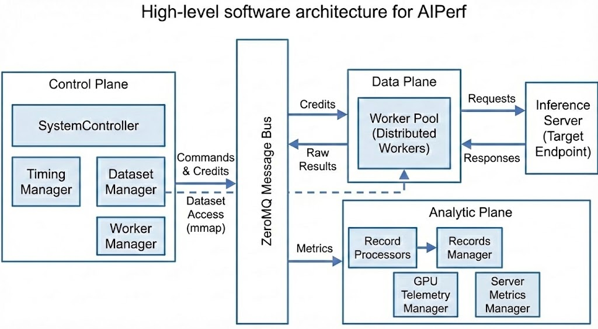
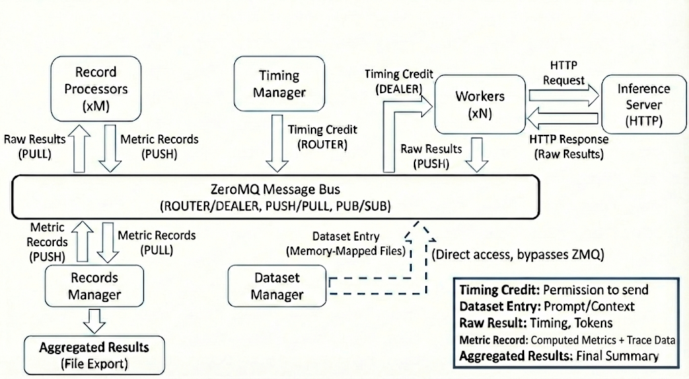

<!--
SPDX-FileCopyrightText: Copyright (c) 2025-2026 NVIDIA CORPORATION & AFFILIATES. All rights reserved.
SPDX-License-Identifier: Apache-2.0
-->

# Architecture of AIPerf

AIPerf is a distributed benchmarking tool for measuring AI inference performance. It generates load against inference endpoints, collects detailed performance metrics, and provides comprehensive analysis of throughput, latency, and resource utilization.

## Architecture Overview

AIPerf is designed as a modular, extensible benchmarking framework that separates concerns across three architectural planes. The system scales horizontally as more workers are added while maintaining centralized orchestration.

### Three-Plane Architecture

| Plane | Components | Purpose |
|-------|-----------|---------|
| **Control Plane** | SystemController, Timing Manager, Dataset Manager, Worker Manager | Decides what, when, and how many requests to send |
| **Data Plane** | Workers, Inference Server | Executes the actual I/O and request/response cycle |
| **Analytic Plane** | Record Processors, Records Manager, GPU Telemetry Manager, Server Metrics Manager | Computes metrics and collects telemetry |

### Request Lifecycle

1. **Initialization**: Dataset Manager loads data, Timing Manager prepares schedule
2. **Execution**: Workers receive credits, access data, send requests to inference server
3. **Collection**: Workers capture response timing and content
4. **Processing**: Record Processors compute metrics in parallel
5. **Aggregation**: Records Manager collects and exports results

## Core Components

### System Controller

The System Controller is the central orchestrator that manages the lifecycle and coordination of all major modules involved in a benchmarking run.

**Key Responsibilities:**
- Registering and initializing core components
- Orchestrating the start, execution, and shutdown of benchmarking tasks
- Handling configuration, resource allocation, and inter-module communication
- Monitoring the overall progress and health of the benchmarking process
- Managing error handling, cleanup, and graceful termination of all modules

### Dataset Manager

The Dataset Manager handles all aspects of input data management during benchmarking runs.

**Key Responsibilities:**
- Loading datasets from various sources (JSONL, CSV, synthetic generators, trace replay formats)
- Parsing and validating input data to ensure it matches the expected format
- Writing dataset to memory-mapped files, enabling workers to access data directly without message passing
- Supporting custom dataset types, such as MoonCake traces, for advanced benchmarking scenarios
- Managing the lifecycle of datasets, including initialization, iteration, and cleanup

### Timing Manager

The Timing Manager controls and coordinates the timing of requests during benchmarking runs through a credit-based system.

**Key Responsibilities:**
- Scheduling when each request should be sent based on the selected timing mode (fixed schedule, request-rate, or user-centric rate)
- Managing precise timing to accurately reproduce real-world or synthetic load patterns
- Supporting advanced timing scenarios, such as replaying traces with specific inter-arrival times or simulating bursty traffic
- Ensuring that requests are dispatched to workers at the correct intervals for reliable measurement

### Worker Manager

The Worker Manager orchestrates and manages the pool of worker processes that execute benchmarking tasks.

**Key Responsibilities:**
- Coordinating with the system controller to spawn and shut down workers that send requests to the inference server
- Monitoring worker status, progress, and resource usage
- Handling worker lifecycle events, such as startup, shutdown, and error recovery
- Managing worker pool size based on benchmarking requirements

### Workers

Workers are the processes that send HTTP requests to the inference server and measure response times.

**Key Responsibilities:**
- Send HTTP requests to inference servers and measure response timing
- Wait for timing credits before sending requests (enables precise load control)
- Track conversation state for multi-turn interactions
- Report timing measurements to Record Processors for analysis

**Scalability:**
- Run multiple workers (e.g., 10, 50, 100+) to support different workload patterns
- No coordination between workers
- Adding more workers increases load capacity and request rates

### Record Processor

The Record Processor processes and interprets the responses received from the inference server during benchmarking.

**Key Responsibilities:**
- Parsing raw inference results to extract relevant metrics (latency, output tokens, correctness)
- Handling different response formats from various model endpoints (OpenAI, vLLM, Triton, custom APIs)
- Validating and normalizing results to ensure consistency across benchmarking runs
- Computing metrics derived from individual requests (TTFT, ITL, Request Latency, Request Throughput etc.)
- Supporting error detection and handling for malformed or unexpected responses
- Scales horizontally to handle high-volume metric computation

### Records Manager

The Records Manager handles the collection, organization, and storage of benchmarking records and results.

**Key Responsibilities:**
- Aggregating data from the records processors (inference results, timing information, metrics)
- Storing records in memory and/or exporting them to files (CSV, JSON) for later analysis
- Providing interfaces for querying, filtering, and summarizing benchmarking results
- Supporting the generation of reports and artifacts for performance evaluation
- Managing the final export of aggregated performance summaries and per-request details

### GPU Telemetry Manager

The GPU Telemetry Manager collects GPU metrics from DCGM (Data Center GPU Manager) Exporter endpoints during benchmarking runs.

**Key Responsibilities:**
- Collecting GPU metrics from DCGM Exporter endpoints (power, utilization, memory, temperature, errors)
- Auto-discovering DCGM endpoints.
- Supporting custom DCGM endpoints via `--gpu-telemetry` flag
- Exporting GPU telemetry alongside benchmark results

### Server Metrics Manager

The Server Metrics Manager collects metrics from Prometheus-compatible endpoints during benchmarking runs.

**Key Responsibilities:**
- Collecting metrics from Prometheus-compatible endpoints (inference server application metrics, system metrics, custom metrics)
- Auto-discovering metrics endpoints from configured inference server URLs (`--url`)
- Supporting custom Prometheus endpoints via `--server-metrics` flag
- Parsing any metrics exposed in Prometheus format (gauges, counters, histograms)
- Typical metrics collected: inference server KV cache usage, request counts, latencies, batch sizes, model-specific metrics, and server resource metrics
- Exporting server metrics alongside benchmark results

## How AIPerf Works

### Credit System & Request Timing

The Timing Manager uses a **credit-based flow control system** to control when requests are sent. This enables accurate load pattern reproduction and prevents server overload.

**How Credits Work:**
- Each credit grants permission to send one request
- The Timing Manager issues credits according to the configured timing mode:
  - **Fixed schedule mode**: Replays conversation traces at precise timestamps from dataset metadata
  - **Request-rate mode**: Issues credits at a specific rate with configurable arrival patterns (constant, Poisson, gamma, concurrency burst)
  - **User-centric rate mode**: Each session acts as a separate user with calculated gaps between turns

**Flow Control Benefits:**
- Prevents overwhelming the inference server
- Enables precise reproduction of load patterns
- Provides natural backpressure when the server slows down
- Allows accurate measurement without artificial delays

**Credit Distribution:**
- Credits are routed to workers via ROUTER/DEALER pattern
- Router selects workers based on sticky sessions (multi-turn conversations) or least-loaded worker selection
- No coordination required between workers
- Scales to large numbers of workers without bottlenecks
- Efficient message routing minimizes overhead

### Data Flow & Messaging

This section describes the end-to-end message flow during a benchmark run, showing how data moves between components through the ZMQ message bus.

**Key Data Structures:**
- **Timing Credit**: Grants permission to send one request
- **Dataset Entry**: Prompt and conversation context
- **Raw Result**: Request timing, tokens, response text
- **Metric Record**: Per-request computed metrics plus trace data
- **Aggregated Results**: Final performance summary and per-request details

**Message Flow:**
1. Credit Router routes credits to workers via ROUTER/DEALER pattern
2. Workers access dataset entries via memory-mapped files
3. Workers send requests to Inference Server (external HTTP)
4. Workers push raw results to Record Processors
5. Record Processors push metric records to Records Manager
6. Records Manager aggregates and exports final results

## Communication Architecture

AIPerf services communicate internally via a **ZeroMQ (ZMQ) message bus**, designed for low-latency, high-throughput message passing between components.

### Why ZMQ?

AIPerf uses ZMQ to maintain **measurement accuracy** by decoupling orchestration logic from execution:

- **Low-overhead messaging**: Credits are routed directly to workers
- **Asynchronous by design**: No blocking calls between services, ensuring workers spend maximum time on I/O and timing
- **Efficient transport**: ZMQ is designed for low-overhead inter-process communication
- **Scalability**: Supports distributed workers across multiple nodes without code changes

### Communication Patterns

AIPerf uses **ZMQ proxies** for message routing between services and workers:

- Services publish strongly-typed messages to specific topics (Pub/Sub pattern)
- Services subscribe to relevant message types
- Router/Dealer patterns for credit distribution to workers
- Request/Reply patterns for synchronous operations

### State Management

**Stateless design** for scalability:
- **Workers**: No shared state between workers; each maintains only local conversation context for multi-turn requests
- **Services**: All service state is ephemeral and can be reconstructed from configuration
- **Coordination**: Credit distribution happens through the message bus; dataset access via memory-mapped files
- **Results**: Only aggregated results are persistent (exported to files)

## Design Principles

AIPerf is built on three core principles:
- **Separation of Concerns**: Control plane orchestrates, workers execute, record processors compute metrics
- **Scalability**: Horizontal scaling for workers and processors with credit-based flow control
- **Extensibility**: Plugin system for datasets, endpoints, transports, and metrics

## Deployment Modes

AIPerf supports distributed execution with two deployment models:

- **Multiprocess Mode**: Each service runs as a separate process on a single node (default for single-node deployments)
- **Kubernetes Mode**: Services and workers run as separate pods in a Kubernetes cluster (for multi-node deployments) *(not yet implemented)*

## External Dependencies

AIPerf integrates with external systems:

- **Inference Server**: The target system being benchmarked (vLLM, Dynamo, SGLang, etc.)
- **DCGM Exporter**: Optional GPU telemetry source for GPU Telemetry Manager (exposes GPU metrics in Prometheus format)
- **Prometheus-compatible endpoints**: Optional server/application metrics source for Server Metrics Manager (inference servers like vLLM expose metrics in Prometheus format at their /metrics endpoint)
