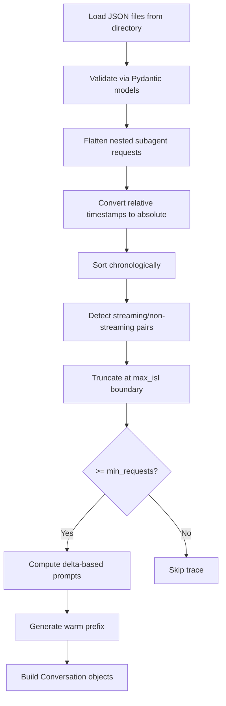
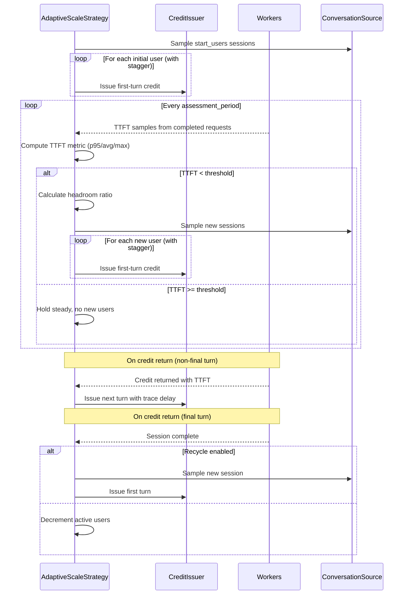

<!--
# SPDX-FileCopyrightText: Copyright (c) 2025-2026 NVIDIA CORPORATION & AFFILIATES. All rights reserved.
# SPDX-License-Identifier: Apache-2.0
-->
# Coding Trace Replay

This guide covers benchmarking LLM inference servers by replaying real agentic coding sessions. Coding trace replay uses the [kv-cache-tester](https://github.com/callanjfox/kv-cache-tester) trace format to reproduce realistic multi-turn coding workflows with accurate KV cache hit patterns, context growth, and inter-request timing.

## When to Use Coding Trace Replay

Use this approach when you need to:

- Benchmark inference servers under realistic agentic coding workloads
- Measure KV cache performance with natural prefix sharing patterns
- Find the maximum sustainable concurrency while keeping TTFT below a threshold
- Validate server behavior as context windows grow across multi-turn sessions
- Compare server configurations using reproducible, production-derived traces

For other use cases:

- **Single-request trace replay**: See [Trace Replay with Mooncake Traces](trace_replay.md)
- **Fixed-rate load testing**: See [Timing Modes Reference](timing-modes-reference.md)
- **Multi-turn with synthetic prompts**: See [User-Centric Timing](../tutorials/user-centric-timing.md)

## Trace Format

Coding traces use the [kv-cache-tester format](https://github.com/callanjfox/kv-cache-tester/tree/master/traces) -- a directory of JSON files where each file represents one agentic coding session. The dataset contains 642 anonymized traces with 112,176 requests and 13.6B tokens captured from real coding sessions.

### Trace File Structure

Each JSON file contains a single trace object:

```json
{
  "id": "trace_0001",
  "models": ["claude-opus-4-5-20251101"],
  "block_size": 64,
  "tool_tokens": 12524,
  "system_tokens": 3189,
  "requests": [
    {
      "t": 0.0,
      "type": "s",
      "in": 20064,
      "out": 797,
      "hash_ids": [101, 102, 103, 104, 105],
      "input_types": ["text"],
      "output_types": ["text"],
      "stop": "end_turn"
    },
    {
      "t": 45.2,
      "type": "n",
      "in": 20064,
      "out": 771,
      "hash_ids": [101, 102, 103, 104, 105],
      "input_types": ["tool_result"],
      "output_types": ["text", "tool_use"],
      "stop": "tool_use"
    },
    {
      "t": 82.7,
      "type": "s",
      "in": 25600,
      "out": 1523,
      "hash_ids": [101, 102, 103, 104, 105, 106, 107],
      "input_types": ["tool_result"],
      "output_types": ["text", "tool_use"],
      "stop": "tool_use",
      "requests": [
        {
          "t": 10.0,
          "type": "s",
          "in": 8192,
          "out": 256,
          "hash_ids": [201, 202],
          "requests": []
        }
      ]
    }
  ]
}
```

### Field Reference

#### Trace-Level Fields

| Field | Type | Required | Description |
|-------|------|----------|-------------|
| `id` | string | Yes | Unique trace identifier (e.g., `trace_0001`) |
| `models` | list[string] | No | Model names used in the original session |
| `block_size` | int | No | KV cache block size in tokens (default: 64) |
| `tool_tokens` | int | No | Estimated token count for tool definitions (default: 0) |
| `system_tokens` | int | No | Estimated token count for system prompt (default: 0) |
| `requests` | list[object] | Yes | Sequence of LLM requests in this session |

#### Request-Level Fields

| Field | Type | Alias | Description |
|-------|------|-------|-------------|
| `t` | float | -- | Relative timestamp in seconds from session start (or parent request for subagents) |
| `type` | string | -- | Request type: `s` (streaming), `n` (non-streaming), `tool_result`, `subagent` |
| `model` | string | -- | Model name used for this request (optional) |
| `in` | int | `input_tokens` | Total context tokens at this turn (cumulative, not delta) |
| `out` | int | `output_tokens` | Expected output token count |
| `hash_ids` | list[int] | -- | KV cache block hashes for prefix sharing analysis |
| `input_types` | list[string] | -- | Input content types (e.g., `text`, `tool_result`) |
| `output_types` | list[string] | -- | Output content types (e.g., `text`, `tool_use`) |
| `stop` | string | -- | Stop reason (e.g., `end_turn`, `tool_use`) |
| `requests` | list[object] | -- | Nested subagent requests (recursive structure) |

### Trace Dataset Characteristics

The kv-cache-tester trace corpus exhibits typical agentic coding session patterns:

| Metric | Median | Description |
|--------|--------|-------------|
| Starting context | 20,160 tokens | Initial input size including system prompt and tools |
| Ending context | 115,008 tokens | Final context size after full conversation |
| Cache hit rate | 96.9% | Hash-based prefix cache reuse between consecutive requests |
| Session duration | 60 minutes | Wall-clock time of the original coding session |

Context grows progressively as tool results, code, and assistant responses accumulate. The high cache hit rate reflects that most context is shared prefix (system prompt, tools, prior turns) with only the newest content being cache-cold.

## How It Works

### Loading and Preprocessing



#### Subagent Flattening

Traces can contain nested `requests` arrays representing subagent calls. The loader recursively flattens these into a linear sequence:

1. Descend into nested `requests` arrays
2. Convert relative timestamps to absolute: `absolute_t = parent_t + request.t`
3. Skip container-only entries (subagent wrappers with `input_tokens == 0`)
4. Sort all flattened requests by absolute timestamp

This produces a chronological sequence where inter-request delays accurately reflect the original session timing, including interleaved subagent work.

#### Delta-Based Prompt Sizing

In the trace format, `input_tokens` (aliased as `in`) represents the **total context** at that turn, not just new content. Since AIPerf's worker accumulates prior turns when building HTTP requests, each turn's prompt only needs to cover the delta:

```
Turn 0: delta = max(1, input_tokens - prefix_tokens)            (full context minus warm prefix)
Turn N: delta = max(1, input_tokens - prev_input - prev_output) (only new content)
```

When no warm prefix is active, `prefix_tokens` is 0 and Turn 0 uses the full `input_tokens`.

A single base prompt is generated at the maximum delta size and truncated by character ratio for smaller deltas, avoiding per-request tokenizer calls.

#### Request Pair Detection

Some traces contain consecutive requests where the second is non-streaming (`n`) with identical `hash_ids` to the previous request. These represent the same conversation being re-sent (typically for tool-use confirmation). The loader detects these pairs and assigns `delta = 1` to the repeat, since no new content is being added.

### Adaptive Scale Execution

During benchmarking, the adaptive scale strategy manages the load:



## Quick Start

### 1. Start an Inference Server

```bash
docker run --gpus all -p 8000:8000 vllm/vllm-openai:latest \
  --model Qwen/Qwen3-0.6B
```

### 2. Download Traces

```bash
git clone https://github.com/callanjfox/kv-cache-tester.git
```

### 3. Run Coding Trace Replay

```bash
aiperf profile \
    --model Qwen/Qwen3-0.6B \
    --endpoint-type chat \
    --streaming \
    --url localhost:8000 \
    --input-file kv-cache-tester/traces/ \
    --custom-dataset-type coding_trace \
    --adaptive-scale \
    --benchmark-duration 300
```

This will:
- Load all 642 traces from the directory
- Flatten subagent requests and compute delta-based prompts
- Generate a warm prefix from system/tool token counts
- Start 1 concurrent user and scale up based on TTFT headroom
- Run for 5 minutes, reporting metrics at the end

## Configuration Reference

### Dataset Options

| Option | Default | Description |
|--------|---------|-------------|
| `--input-file` | -- | Path to trace directory or single JSON file |
| `--custom-dataset-type coding_trace` | -- | Required: selects the coding trace loader |
| `--warm-prefix-pct` | 0.5 | Warm prefix size as fraction of max(tool_tokens + system_tokens) |
| `--synthesis-max-isl` | None | Truncate conversations at first request exceeding this input token count |
| `--synthesis-min-requests` | 2 | Skip traces with fewer requests after truncation |

### Adaptive Scale Options

| Option | Default | Description |
|--------|---------|-------------|
| `--adaptive-scale` | false | Enable adaptive user scaling (auto-enabled with `coding_trace` dataset) |
| `--adaptive-scale-start-users` | 1 | Number of concurrent users to start with |
| `--adaptive-scale-max-users` | 50 | Maximum concurrent users ceiling |
| `--adaptive-scale-max-ttft` | 2.0 | TTFT threshold in seconds; scaling stops when exceeded |
| `--adaptive-scale-ttft-metric` | p95 | Metric for scaling decisions: `p95`, `avg`, or `max` |
| `--adaptive-scale-assessment-period` | 30.0 | Seconds between scaling assessments |
| `--adaptive-scale-max-delay` | 60.0 | Clamp inter-request delays at this value (seconds) |
| `--adaptive-scale-time-scale` | 1.0 | Multiplier for trace inter-request delays |
| `--adaptive-scale-recycle` | false | Restart completed sessions with new traces |
| `--adaptive-scale-stagger-ms` | 50 | Milliseconds between launching new users in a batch |
| `--adaptive-scale-formula` | conservative | Scaling formula: `conservative`, `aggressive`, or `linear` |
| `--adaptive-scale-max-new-tokens-per-period` | 500000 | Token budget per assessment period to prevent cache-miss bursts |
| `--adaptive-scale-slo` | None | SLO thresholds for goodput-based scaling (e.g., `time_to_first_token:500 request_latency:2000` in ms) |
| `--adaptive-scale-min-goodput-ratio` | 0.95 | Minimum fraction of requests meeting all SLOs to continue scaling up |

### Scaling Modes

Adaptive scale supports two scaling modes:

**TTFT Headroom (default)**: Scales up while the TTFT metric stays below `--adaptive-scale-max-ttft`. This is the simplest mode and works well when TTFT is the primary indicator of server saturation.

**Goodput Ratio (SLO-based)**: When `--adaptive-scale-slo` is configured, scaling switches to goodput ratio mode. Each completed request is evaluated against all SLO thresholds. Users are added only when the fraction of "good" requests (meeting all SLOs) is at or above `--adaptive-scale-min-goodput-ratio`. This mode detects saturation that manifests in multiple metrics (e.g., both TTFT and request latency).

Supported SLO metrics:
- `time_to_first_token` (ms): Time to first token
- `request_latency` (ms): Total request latency (end-to-end)

### Scaling Formulas

The scaling formula determines how many users to add when TTFT headroom exists:

| Formula | Calculation | Behavior |
|---------|-------------|----------|
| `conservative` | `max(1, int(active_users * headroom_ratio * 0.5))` | Self-regulating: scales proportionally to current load with 50% damping. Good for production servers where overshooting is costly. |
| `aggressive` | `max(2, 2 + int(headroom_pct / 10))` | Always adds at least 2 users. At 80% headroom, adds 10. Finds the ceiling faster but risks overshooting. |
| `linear` | `max(1, int(headroom_pct / 5))` | Adds 1 user per 5% headroom. Predictable linear ramp. |

Where:
- `headroom_ratio = 1.0 - (ttft_metric_value / max_ttft)`
- `headroom_pct = headroom_ratio * 100`

### Stop Conditions

At least one stop condition is required:

| Option | Description |
|--------|-------------|
| `--benchmark-duration` | Run for this many seconds |
| `--request-count` | Stop after this many total requests |
| `--num-sessions` | Stop after starting this many sessions |

## Examples

### Find Maximum Sustainable Concurrency

The primary use case: scale up users until TTFT hits 2 seconds, finding the server's capacity ceiling.

```bash
aiperf profile \
    --model your-model \
    --endpoint-type chat \
    --streaming \
    --url localhost:8000 \
    --input-file traces/ \
    --custom-dataset-type coding_trace \
    --adaptive-scale \
    --adaptive-scale-max-ttft 2.0 \
    --adaptive-scale-ttft-metric p95 \
    --benchmark-duration 600
```

### Aggressive Scaling for Quick Capacity Finding

Use the aggressive formula with shorter assessment periods to find the ceiling faster.

```bash
aiperf profile \
    --model your-model \
    --endpoint-type chat \
    --streaming \
    --url localhost:8000 \
    --input-file traces/ \
    --custom-dataset-type coding_trace \
    --adaptive-scale \
    --adaptive-scale-formula aggressive \
    --adaptive-scale-assessment-period 15 \
    --adaptive-scale-max-users 100 \
    --benchmark-duration 300
```

### Accelerated Replay

Speed up trace timing by 2x to stress-test with compressed inter-request delays.

```bash
aiperf profile \
    --model your-model \
    --endpoint-type chat \
    --streaming \
    --url localhost:8000 \
    --input-file traces/ \
    --custom-dataset-type coding_trace \
    --adaptive-scale \
    --adaptive-scale-time-scale 0.5 \
    --adaptive-scale-max-delay 30 \
    --benchmark-duration 300
```

A `time_scale` of 0.5 halves all inter-request delays, effectively replaying sessions at 2x speed.

### Long-Running with Session Recycling

Recycle completed sessions to maintain load over extended benchmarks.

```bash
aiperf profile \
    --model your-model \
    --endpoint-type chat \
    --streaming \
    --url localhost:8000 \
    --input-file traces/ \
    --custom-dataset-type coding_trace \
    --adaptive-scale \
    --adaptive-scale-recycle \
    --benchmark-duration 1800
```

### Constrained Context Window

Limit traces to fit a smaller context window and prevent OOM errors.

```bash
aiperf profile \
    --model your-model \
    --endpoint-type chat \
    --streaming \
    --url localhost:8000 \
    --input-file traces/ \
    --custom-dataset-type coding_trace \
    --adaptive-scale \
    --synthesis-max-isl 32000 \
    --benchmark-duration 300
```

Conversations are truncated at the first request exceeding 32K input tokens. Traces that fall below `--synthesis-min-requests` after truncation are skipped entirely.

### No Warm Prefix

Disable the warm prefix to benchmark cold-cache performance.

```bash
aiperf profile \
    --model your-model \
    --endpoint-type chat \
    --streaming \
    --url localhost:8000 \
    --input-file traces/ \
    --custom-dataset-type coding_trace \
    --adaptive-scale \
    --warm-prefix-pct 0.0 \
    --benchmark-duration 300
```

### SLO-Based Scaling

Use goodput ratio scaling with multiple SLO thresholds for more nuanced capacity finding.

```bash
aiperf profile \
    --model your-model \
    --endpoint-type chat \
    --streaming \
    --url localhost:8000 \
    --input-file traces/ \
    --custom-dataset-type coding_trace \
    --adaptive-scale \
    --adaptive-scale-slo time_to_first_token:500 request_latency:2000 \
    --adaptive-scale-min-goodput-ratio 0.95 \
    --benchmark-duration 600
```

This scales up while at least 95% of requests have TTFT under 500ms **and** total latency under 2000ms.

### Token Budget Control

Limit new tokens per assessment period to prevent cache-miss bursts when many users start simultaneously.

```bash
aiperf profile \
    --model your-model \
    --endpoint-type chat \
    --streaming \
    --url localhost:8000 \
    --input-file traces/ \
    --custom-dataset-type coding_trace \
    --adaptive-scale \
    --adaptive-scale-max-new-tokens-per-period 250000 \
    --benchmark-duration 300
```

## Warm Prefix

The warm prefix is a shared system message prepended to all conversations. It simulates the cross-conversation KV cache sharing that occurs in production when multiple users share the same tool definitions and system prompt.

### How It Works

1. **Size calculation**: `warm_prefix_pct * max(tool_tokens + system_tokens)` across all loaded traces
2. **Content generation**: A synthetic prompt of the calculated size is generated using a fixed seed
3. **Placement**: Set as `conversation.system_message`, shared identically across all conversations
4. **First-turn adjustment**: The first turn's delta is reduced by the prefix token count to keep total context aligned with the trace's intended `input_tokens`

With the default `--warm-prefix-pct 0.5` and traces averaging 15,000 combined tool/system tokens, the warm prefix is approximately 7,500 tokens.

## Understanding the Output

AIPerf reports standard metrics after the benchmark completes:

- **TTFT (Time To First Token)**: The primary metric for coding trace replay. Measures cache effectiveness and prefill latency.
- **ITL (Inter-Token Latency)**: Time between generated tokens during decoding.
- **Throughput**: Input and output tokens per second.
- **Concurrency**: The number of active users at various points during the benchmark.

The adaptive scale strategy logs scaling decisions during the run:

```
Adaptive scale: started 1 users, max_ttft=2.0s, metric=p95, assessment_period=30.0s
TTFT p95=0.312s, headroom=84.4%, adding 1 users (total=2)
TTFT p95=0.487s, headroom=75.6%, adding 1 users (total=3)
TTFT p95=1.823s, headroom=8.8%, adding 1 users (total=4)
TTFT p95=2.145s >= threshold 2.0s, not adding users (active=4)
```

This shows the server sustained 3 concurrent coding sessions before TTFT exceeded the 2-second threshold.
