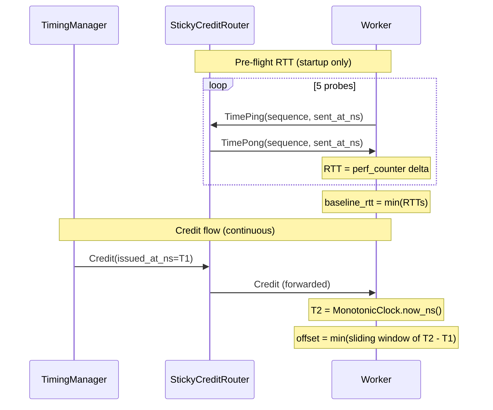

# Time Synchronization

In Kubernetes deployments, the TimingManager (controller pod) and Workers (worker pods) run on different machines with potentially different clocks. AIPerf uses credit-based clock offset tracking to align worker timestamps to the controller's reference frame.

## Problem

Wall-clock timestamps (`time.time_ns()`) from different machines are not directly comparable. NTP keeps nodes within 1-10ms of UTC, but nodes synchronize independently to external sources, not to each other. Two workers could each be 5ms off from UTC in opposite directions, giving a 10ms relative skew that distorts cross-worker metrics.

AIPerf needs timestamps aligned to a **single reference** (TimingManager) rather than to an external source.

## Design Principles

- **TimingManager is the single source of truth for time.** All worker timestamps are adjusted to align with TimingManager's clock.
- **Zero overhead.** Synchronization piggybacks on existing credit messages. Every credit already flows from TimingManager through the router to Worker; adding a timestamp costs nothing.
- **Minimum offset filtering.** The minimum sample in a sliding window is the best offset estimate — the maximum likelihood estimator under the standard exponential delay model (RFC 5905).
- **Monotonic wall-clock timestamps.** A shared `MonotonicClock` captures `time.time_ns()` once at startup and derives all subsequent timestamps from `time.perf_counter_ns()` deltas — monotonic, immune to NTP step corrections, and still in the wall-clock domain.

## Architecture



## Offset Measurement

Each credit carries `issued_at_ns`, the controller's monotonic wall-clock timestamp. When a worker receives a credit, it computes `sample = MonotonicClock.now_ns() - issued_at_ns`, appends the sample to a sliding window (size 20), and sets `offset_ns = min(window)`.

### Why Minimum Filtering

Every one-way measurement includes clock skew plus network transit: `sample = clock_skew + network_transit`. Network transit is always positive and varies due to queuing. The minimum sample has the least queuing delay, making it the best estimate of the fixed component.

This is well-established:

- **NTP (RFC 5905)** selects minimum delay from an 8-stage shift register. Mills showed mean error drops from 0.724ms to 0.192ms with this filtering.
- **PTP (IEEE 1588)** uses window filters (typically 32 samples) searching for minimum delay packets.
- **Information theory** shows the minimum is the MLE of the fixed delay component under the exponential queuing model.

An exponential moving average would be biased — queuing noise is one-sided (delays only increase from the minimum), so averaging systematically overestimates.

### Calibration

The tracker reports `is_calibrated = True` after `min_samples` (default 5) measurements. Before calibration, `offset_ns` is set but should be treated as preliminary. The `offset_range_ns` property (max - min in the window) indicates network jitter.

## Pre-Flight RTT Measurement

The one-way offset cannot distinguish clock skew from network transit. An optional startup RTT measurement decomposes it:

```
estimated_one_way = baseline_rtt // 2
estimated_clock_skew = offset - estimated_one_way
```

Before sending `WorkerReady`, each worker sends 5 `TimePing` probes on the credit DEALER/ROUTER socket and waits for `TimePong` echoes. The minimum RTT becomes `baseline_rtt_ns`. This follows Cristian's algorithm with the improvement of taking multiple probes and selecting the minimum for tighter bounds.

RTT measurement runs once at startup in both local and Kubernetes modes, on the exact same DEALER/ROUTER path that credits travel.

## Timestamp Correction

Every `RequestRecord` includes `clock_offset_ns` — the worker's best-estimate offset when the record was created:

```python
controller_time = record.timestamp_ns - record.clock_offset_ns
```

`ClockOffsetTracker.correct_timestamp()` provides the same conversion programmatically, returning the input unchanged if no offset has been measured yet.

## MonotonicClock

Both controller and worker need timestamps that are monotonic, high-resolution, and in the wall-clock domain. `MonotonicClock` captures `time.time_ns()` once as a wall-clock anchor and derives all subsequent timestamps from `time.perf_counter_ns()` deltas:

```python
class MonotonicClock:
    def __init__(self) -> None:
        self.perf_anchor_ns = time.perf_counter_ns()
        self.wall_anchor_ns = time.time_ns()

    def now_ns(self) -> int:
        return self.wall_anchor_ns + (time.perf_counter_ns() - self.perf_anchor_ns)
```

The controller creates one when the phase starts (`PhaseLifecycle.start()`); `CreditIssuer` calls `clock.now_ns()` to stamp each credit. Each worker creates its own at `ClockOffsetTracker` construction time.

## Reference

### Messages

| Message | Direction | Socket | Purpose |
|---|---|---|---|
| `Credit` | Router -> Worker | DEALER/ROUTER | Carries `issued_at_ns` for offset measurement |
| `TimePing` | Worker -> Router | DEALER/ROUTER | Pre-flight RTT probe |
| `TimePong` | Router -> Worker | DEALER/ROUTER | RTT probe echo |

### ClockOffsetTracker State

| Attribute | Type | Description |
|---|---|---|
| `offset_ns` | `int \| None` | Best-estimate clock offset (min of window) |
| `sample_count` | `int` | Total offset measurements recorded |
| `is_calibrated` | `bool` | True after `min_samples` measurements |
| `offset_range_ns` | `int \| None` | Max - min in window (jitter indicator) |
| `baseline_rtt_ns` | `int \| None` | Minimum RTT from startup probes |
| `estimated_one_way_ns` | `int \| None` | `baseline_rtt_ns // 2` |
| `estimated_clock_skew_ns` | `int \| None` | `offset_ns - estimated_one_way_ns` |
| `clock_offset_ns` | `int \| None` | Field on `RequestRecord` — offset at record creation time |

### Configuration

Default parameters (not user-configurable):

| Parameter | Default | Description |
|---|---|---|
| `window_size` | 20 | Samples retained in sliding window |
| `min_samples` | 5 | Samples required for `is_calibrated` |
| `probe_count` | 5 | TimePing probes at startup |
| `timeout` | 5.0s | Per-probe timeout for RTT measurement |

## Accuracy and Alternatives

| Environment | Expected Accuracy |
|---|---|
| Same machine (local mode) | < 0.1ms |
| Same datacenter (K8s) | 1-5ms |
| Cross-zone (same region) | 5-20ms |

For typical benchmarking workloads where request latencies are 10ms-10s, millisecond-level accuracy is sufficient.

| Approach | Overhead | Accuracy | Complexity |
|---|---|---|---|
| **Credit-based (AIPerf)** | Zero (piggyback) | ~1-5ms | Low |
| **NTP** | External daemon | 1-10ms | Pre-configured |
| **PTP (IEEE 1588)** | Dedicated hardware | < 1us | High |

Credit-based sync is **complementary to NTP**, not a replacement. NTP synchronizes each node to UTC; credit-based sync aligns workers to the TimingManager within that environment.

## Limitations

- **One-way measurement**: Cannot distinguish forward vs. reverse path delay. Asymmetric paths introduce systematic bias equal to half the delay difference — negligible in datacenter LANs.
- **No drift compensation**: `MonotonicClock` uses `perf_counter_ns` (hardware oscillator), which drifts at 10-50 ppm (~180ms/hour at 50 ppm) and is not disciplined by NTP. The sliding window absorbs drift as long as credits keep flowing, but if credit flow pauses the stale window minimum will diverge. For multi-hour benchmarks this is fine in practice — credits flow continuously during profiling.
- **Point estimate**: Reports a single offset, not an uncertainty interval. `offset_range_ns` provides a rough proxy.
