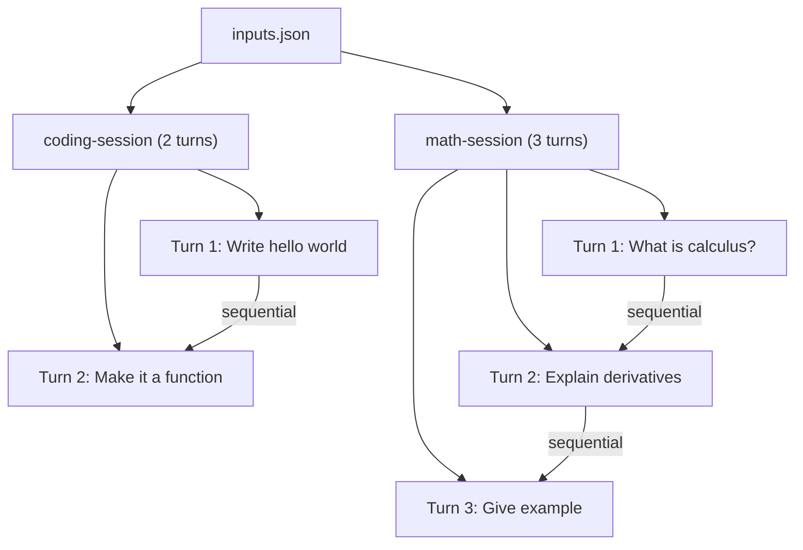

<!--
SPDX-FileCopyrightText: Copyright (c) 2025-2026 NVIDIA CORPORATION & AFFILIATES. All rights reserved.
SPDX-License-Identifier: Apache-2.0
-->

# Inputs JSON Replay

Replay multi-turn conversations from AIPerf's `inputs.json` format with pre-built payloads sent verbatim.

## Overview

The `inputs_json` dataset type loads AIPerf's structured inputs file format where each session contains ordered payloads. This is useful when you have pre-built conversations organized by session and want to replay them exactly as-is:

- **Session-aware**: Each session ID maps to a multi-turn conversation
- **Ordered turns**: Payloads within a session are sent sequentially as conversation turns
- **Verbatim replay**: Each payload is sent directly to the server with zero formatting
- **Structured format**: Single JSON file with all sessions and turns

## File Format

The inputs file is a JSON file (not JSONL) with the following structure:

```json
{
  "data": [
    {
      "session_id": "session-001",
      "payloads": [
        {"messages": [{"role": "user", "content": "Hello"}], "model": "Qwen/Qwen3-0.6B", "max_tokens": 100},
        {"messages": [{"role": "user", "content": "Hello"}, {"role": "assistant", "content": "Hi!"}, {"role": "user", "content": "How are you?"}], "model": "Qwen/Qwen3-0.6B", "max_tokens": 100}
      ]
    },
    {
      "session_id": "session-002",
      "payloads": [
        {"messages": [{"role": "user", "content": "What is AI?"}], "model": "Qwen/Qwen3-0.6B", "max_tokens": 200}
      ]
    }
  ]
}
```

| Field | Description |
|-------|-------------|
| `data` | Top-level array of sessions |
| `session_id` | Unique identifier for each conversation |
| `payloads` | Ordered list of complete API request bodies (turns) |

## Preparing the Data

```bash
cat > inputs.json << 'EOF'
{
  "data": [
    {
      "session_id": "coding-session",
      "payloads": [
        {"messages": [{"role": "user", "content": "Write a hello world in Python."}], "model": "Qwen/Qwen3-0.6B", "max_tokens": 100},
        {"messages": [{"role": "user", "content": "Write a hello world in Python."}, {"role": "assistant", "content": "print('Hello, World!')"}, {"role": "user", "content": "Now make it a function."}], "model": "Qwen/Qwen3-0.6B", "max_tokens": 200}
      ]
    },
    {
      "session_id": "math-session",
      "payloads": [
        {"messages": [{"role": "system", "content": "You are a math tutor."}, {"role": "user", "content": "What is calculus?"}], "model": "Qwen/Qwen3-0.6B", "max_tokens": 300},
        {"messages": [{"role": "system", "content": "You are a math tutor."}, {"role": "user", "content": "What is calculus?"}, {"role": "assistant", "content": "Calculus is..."}, {"role": "user", "content": "Explain derivatives."}], "model": "Qwen/Qwen3-0.6B", "max_tokens": 300},
        {"messages": [{"role": "system", "content": "You are a math tutor."}, {"role": "user", "content": "What is calculus?"}, {"role": "assistant", "content": "Calculus is..."}, {"role": "user", "content": "Explain derivatives."}, {"role": "assistant", "content": "A derivative is..."}, {"role": "user", "content": "Give me an example."}], "model": "Qwen/Qwen3-0.6B", "max_tokens": 300}
      ]
    }
  ]
}
EOF
```

## Running the Benchmark

```bash
aiperf profile \
    --model Qwen/Qwen3-0.6B \
    --endpoint-type raw \
    --endpoint /v1/chat/completions \
    --input-file inputs.json \
    --custom-dataset-type inputs_json \
    --streaming \
    --url localhost:8000 \
    --concurrency 2
```

## How It Works



- Each session becomes one Conversation
- Payloads are sent in order as sequential turns
- Multiple sessions run concurrently (up to `--concurrency`)
- Session IDs from the file are preserved

## Comparison with Raw Payload

Both `inputs_json` and `raw_payload` send payloads verbatim, but they differ in structure:

| Feature | `raw_payload` (file) | `raw_payload` (directory) | `inputs_json` |
|---------|---------------------|--------------------------|---------------|
| Input format | JSONL | Directory of JSONL | Single JSON |
| Multi-turn | No (1 line = 1 conversation) | Yes (1 file = 1 conversation) | Yes (1 session = 1 conversation) |
| Session IDs | Auto-generated | Auto-generated | From file (`session_id` field) |
| Auto-detection | By content (`messages` key) | By directory content | By structure (`data` + `payloads` keys) |

**Choose `inputs_json` when** you have a structured file with named sessions and want to preserve session IDs. **Choose `raw_payload`** when you have flat JSONL logs or a directory of captured conversations.

## Key Points

- The file must have a `.json` extension for auto-detection via filename
- Each payload in `payloads` is a complete API request body sent verbatim
- The `--model` flag is required for metrics reporting but does not override payload contents
- Empty `payloads` lists are valid but produce conversations with no turns
