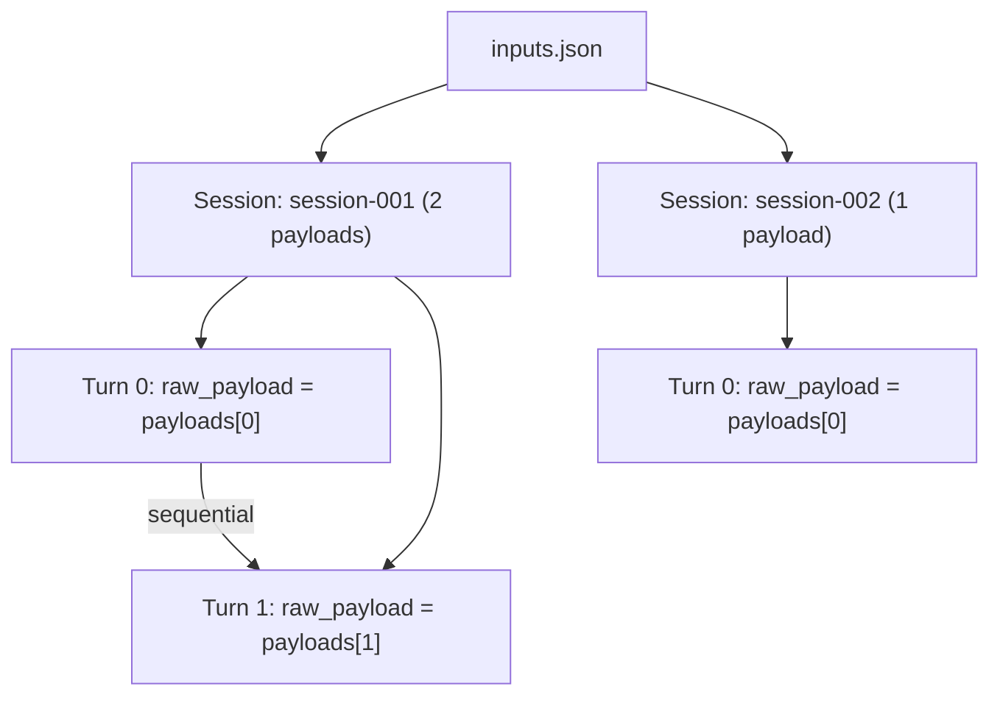

<!--
SPDX-FileCopyrightText: Copyright (c) 2026 NVIDIA CORPORATION & AFFILIATES. All rights reserved.
SPDX-License-Identifier: Apache-2.0
-->

# Inputs JSON Replay

Replay pre-formatted multi-turn API payloads from AIPerf's `inputs.json` file format.

## Overview

Every AIPerf benchmark run produces an `inputs.json` artifact in the output directory. This file captures the exact API request payloads that were sent during the benchmark, organized by session. The `inputs_json` dataset loader reads this file back and replays its payloads verbatim, without any endpoint formatting.

### When to Use

- **Reproducible replay**: Re-run a previous benchmark with the exact same payloads
- **Cross-server comparison**: Run identical payloads against different inference servers
- **Payload editing**: Modify specific payloads in the JSON file, then replay
- **Debugging**: Isolate specific sessions or turns from a prior run for investigation

### How It Works

1. AIPerf reads the JSON file and parses each entry in the `data` array
2. Each entry becomes a `Conversation` -- the `session_id` identifies the conversation and `payloads` become its turns
3. Each payload is stored as a `raw_payload` on the turn, bypassing all endpoint formatting
4. The transport sends each payload dict directly to the server as-is

---

## File Format

The `inputs.json` file is a single JSON object with a top-level `data` array. Each element in the array represents one session (conversation) with an ordered list of API request payloads.

```json
{
  "data": [
    {
      "session_id": "session-001",
      "payloads": [
        {
          "messages": [{"role": "user", "content": "Hello"}],
          "model": "gpt-4",
          "max_tokens": 1024
        },
        {
          "messages": [
            {"role": "user", "content": "Hello"},
            {"role": "assistant", "content": "Hi there!"},
            {"role": "user", "content": "How are you?"}
          ],
          "model": "gpt-4",
          "max_tokens": 1024
        }
      ]
    },
    {
      "session_id": "session-002",
      "payloads": [
        {
          "messages": [{"role": "user", "content": "What is Python?"}],
          "model": "gpt-4",
          "max_tokens": 2048,
          "stream": true
        }
      ]
    }
  ]
}
```

### Structure Reference

| Field | Type | Required | Description |
|-------|------|----------|-------------|
| `data` | array | Yes | Top-level array of session objects |
| `data[].session_id` | string | Yes | Unique identifier for the conversation session |
| `data[].payloads` | array of objects | Yes | Ordered list of per-turn API request payloads |

Each object inside `payloads` is an arbitrary JSON dict -- it is sent directly to the inference server without modification. The loader does not inspect or validate payload contents.

### Mapping to Conversations



Each session becomes one `Conversation`. Each payload becomes one `Turn` with role `"user"` and the entire payload dict stored as `raw_payload`. Because `raw_payload` is set, the worker sends the dict directly to the transport -- it never passes through the endpoint's `format_payload` method.

---

## Auto-Detection

When you provide an `--input-file` pointing to a `.json` file (not `.jsonl`), AIPerf auto-detects the `inputs_json` format by checking:

1. The file has a `.json` extension
2. The parsed content has a top-level `data` key containing a non-empty list
3. The first element in the list has a `payloads` key containing a list

If all three conditions are met, AIPerf selects the `InputsJsonPayloadLoader` automatically. You can also force it with `--custom-dataset-type inputs_json`.

---

## Basic Usage

### Replaying a Previous Benchmark

After running any AIPerf benchmark, an `inputs.json` file is generated in the artifact directory. Replay it:

```bash
aiperf profile \
    --input-file artifacts/my-benchmark/inputs.json \
    --endpoint-type raw \
    --streaming \
    --url localhost:8000 \
    --concurrency 4
```

The `--endpoint-type raw` is required because `inputs_json` payloads are pre-formatted. The `raw` endpoint does not apply any formatting -- it sends the payload dicts verbatim and parses responses using auto-detection.

### Specifying the Dataset Type Explicitly

If auto-detection does not work (for example, a non-standard file extension), specify the type:

```bash
aiperf profile \
    --input-file my-payloads.json \
    --custom-dataset-type inputs_json \
    --endpoint-type raw \
    --streaming \
    --url localhost:8000 \
    --concurrency 2
```

---

## Configuration Options

### Relevant CLI Options

| Option | Default | Description |
|--------|---------|-------------|
| `--input-file` | None | Path to the inputs JSON file. Required for `inputs_json` |
| `--custom-dataset-type` | None (auto-detected) | Set to `inputs_json` to force this loader |
| `--endpoint-type` | `chat` | Use `raw` for verbatim payload replay |
| `--dataset-sampling-strategy` | `sequential` | How sessions are assigned to workers. The `inputs_json` loader prefers `sequential` by default |
| `--concurrency` | (varies) | Number of concurrent users. Multiple conversations run in parallel |
| `--streaming` | false | Enable streaming responses |

### Sampling Strategy

The `inputs_json` loader's preferred sampling strategy is `sequential`, meaning sessions are iterated in the order they appear in the file, wrapping back to the start after all sessions have been used. You can override this with `--dataset-sampling-strategy`:

- `sequential` (default): Sessions are replayed in file order
- `shuffle`: Sessions are shuffled, then iterated without replacement; re-shuffled after exhaustion
- `random`: Sessions are randomly sampled with replacement

---

## The Raw Endpoint

The `raw` endpoint (`--endpoint-type raw`) is designed specifically for verbatim replay workloads like `inputs_json`. It:

- Raises `NotImplementedError` from `format_payload` -- payloads must already be complete API requests
- Parses responses using auto-detection (works with OpenAI, Anthropic, and other common response formats)
- Supports streaming responses
- Supports optional JMESPath extraction via `response_field` in `--extra-inputs`

Since `inputs_json` payloads already contain model names, message arrays, and all other API parameters, no additional formatting is needed.

---

## Practical Examples

### Cross-Server Comparison

Run the same payloads against two different servers to compare performance:

```bash
# Capture payloads from server A
aiperf profile \
    --model Qwen/Qwen3-0.6B \
    --endpoint-type chat \
    --url server-a:8000 \
    --concurrency 4

# Replay against server B using the generated inputs.json
aiperf profile \
    --input-file artifacts/Qwen_Qwen3-0.6B-openai-chat-concurrency4/inputs.json \
    --endpoint-type raw \
    --url server-b:8000 \
    --concurrency 4
```

### Crafting a Custom Inputs File

Create a minimal inputs.json by hand for targeted testing:

```bash
cat > custom-inputs.json << 'EOF'
{
  "data": [
    {
      "session_id": "coding-task",
      "payloads": [
        {
          "model": "Qwen/Qwen3-0.6B",
          "messages": [{"role": "user", "content": "Write a Python function to sort a list."}],
          "max_tokens": 512,
          "stream": true
        },
        {
          "model": "Qwen/Qwen3-0.6B",
          "messages": [
            {"role": "user", "content": "Write a Python function to sort a list."},
            {"role": "assistant", "content": "def sort_list(lst):\n    return sorted(lst)"},
            {"role": "user", "content": "Now add type hints and a docstring."}
          ],
          "max_tokens": 512,
          "stream": true
        }
      ]
    },
    {
      "session_id": "single-question",
      "payloads": [
        {
          "model": "Qwen/Qwen3-0.6B",
          "messages": [{"role": "user", "content": "What is the capital of France?"}],
          "max_tokens": 128
        }
      ]
    }
  ]
}
EOF

aiperf profile \
    --input-file custom-inputs.json \
    --endpoint-type raw \
    --streaming \
    --url localhost:8000 \
    --concurrency 2
```

### Replaying with Different Concurrency

Test how throughput scales by replaying the same payloads at different concurrency levels:

```bash
for c in 1 2 4 8; do
    aiperf profile \
        --input-file artifacts/my-benchmark/inputs.json \
        --endpoint-type raw \
        --streaming \
        --url localhost:8000 \
        --concurrency $c
done
```

---

## Comparison with Raw Payload

Both `inputs_json` and `raw_payload` send payloads verbatim, but they differ in structure:

| Feature | `raw_payload` (file) | `raw_payload` (directory) | `inputs_json` |
|---------|---------------------|--------------------------|---------------|
| Input format | JSONL | Directory of JSONL | Single JSON |
| Multi-turn | No (1 line = 1 conversation) | Yes (1 file = 1 conversation) | Yes (1 session = 1 conversation) |
| Session IDs | Auto-generated | Auto-generated | From file (`session_id` field) |
| Auto-detection | By content (`messages` key) | By directory content | By structure (`data` + `payloads` keys) |

Choose `inputs_json` when you have a structured file with named sessions and want to preserve session IDs. Choose `raw_payload` when you have flat JSONL logs or a directory of captured conversations.

---

## Tips

- **Always use `--endpoint-type raw`**: The `inputs_json` loader produces `raw_payload` turns that bypass endpoint formatting. Using any other endpoint type will cause the endpoint to attempt formatting on already-complete payloads.
- **Payloads are sent verbatim**: Whatever is in each payload dict is sent directly to the server. The loader does not add, remove, or modify any fields.
- **File must be `.json` for auto-detection**: Auto-detection only recognizes `.json` files, not `.jsonl`. Use `--custom-dataset-type inputs_json` if your file has a different extension.
- **Multi-turn sessions run sequentially**: Within each session, turns execute in order (turn 0, then turn 1, etc.). Different sessions run concurrently up to `--concurrency`.
- **Check the artifact directory**: After any AIPerf run, look for `inputs.json` in the artifact directory. This is the file you can feed back into `--input-file` for replay.
- **The `model` field in payloads is what the server receives**: Since the `raw` endpoint does not format payloads, the model name inside each payload dict is what gets sent to the server.
