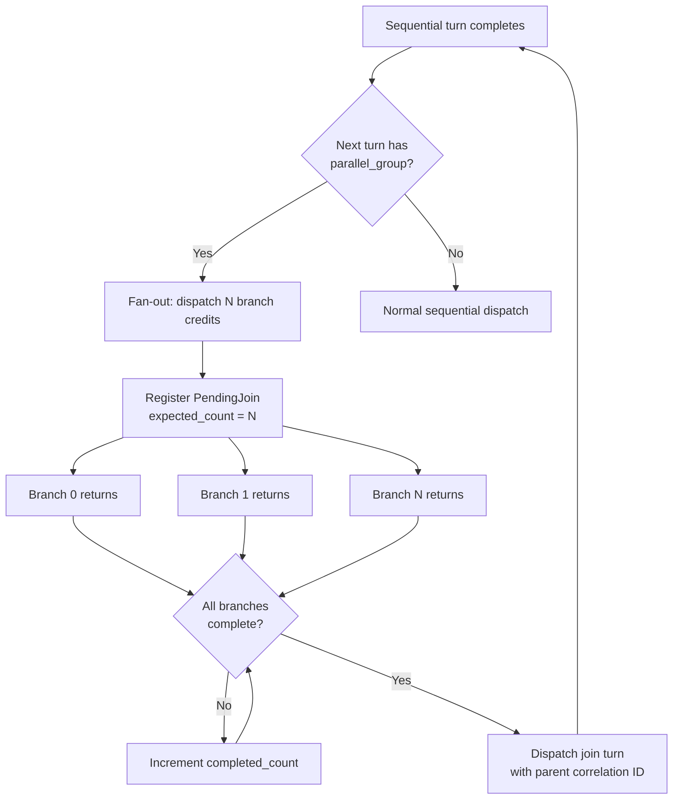

<!--
SPDX-FileCopyrightText: Copyright (c) 2025-2026 NVIDIA CORPORATION & AFFILIATES. All rights reserved.
SPDX-License-Identifier: Apache-2.0
-->

# Parallel Tool Calls

AIPerf models the real-world pattern where an agentic LLM spawns multiple concurrent sub-agent or tool calls that run in parallel, then reconverges into a single sequential turn. This **fan-out/join** pattern benchmarks how inference servers handle concurrent, cache-sharing requests from agentic workloads.

## Overview

When an AI coding agent (like Claude Code) processes a task, it often fans out multiple tool calls simultaneously -- reading files, running searches, or spawning sub-agents -- before joining the results back into a single response. This creates a distinctive load pattern:

- N concurrent requests share a common KV cache prefix but diverge at the tail
- All branches must hit the same server for cache reuse
- Total wall time depends on the slowest branch
- The join turn resumes only after all branches complete

AIPerf reproduces this pattern to stress-test:

- **KV cache sharing efficiency** -- branches should reuse the parent's cached prefix
- **Concurrent request handling** -- N simultaneous requests per session
- **Session affinity** -- all branches must route to the same worker
- **Join latency** -- measured as wall time of the slowest branch

## Data Model

Turns in a conversation carry two optional fields that identify parallel groups:

| Field | Example | Description |
|---|---|---|
| `parallel_group` | `"g0"` | All turns sharing this value are concurrent branches |
| `parallel_branch` | `0`, `1`, `2` | Branch index within the group |

A `ParallelGroupInfo` is precomputed per conversation, listing the turn indices of all branches and the **join turn index** (the first sequential turn after all branches complete).

## Sources of Parallel Groups

### Synthetic Generation

The `CodingSessionComposer` generates parallel groups during synthetic coding session creation. After each sequential turn, with configurable probability, a fan-out is generated:

1. Branch count is Poisson-sampled from the configured mean, clamped to `[2, max]`
2. Each branch gets unique tokens appended to the parent's shared prefix (modeling cache sharing with divergent tails)
3. A join turn follows with cumulative tokens grown by the sum of all branch deltas

### Real Trace Replay

The `CodingTraceLoader` detects parallel groups from captured traces by walking the nested sub-agent request tree. When a parent request node has multiple child requests, those children become a parallel group in the flattened turn list.

## Configuration

All parallel tool call parameters are in the `--input` CLI group:

| Flag | Default | Description |
|---|---|---|
| `--coding-session-parallel-probability` | `0.3` | Probability each sequential turn fans out |
| `--coding-session-parallel-fan-out-mean` | `3.0` | Poisson mean for branch count |
| `--coding-session-parallel-fan-out-max` | `8` | Maximum branches per group |
| `--coding-session-parallel-branch-tokens-mean` | `800` | Mean new tokens per branch (lognormal) |
| `--coding-session-parallel-branch-tokens-median` | `400` | Median tokens per branch (lognormal) |

### Example: High Fan-Out Stress Test

```bash
aiperf profile \
  --url http://localhost:8000/v1 \
  --model my-model \
  --timing-mode adaptive-scale \
  --input-mode coding-session \
  --coding-session-parallel-probability 0.6 \
  --coding-session-parallel-fan-out-mean 5.0 \
  --coding-session-parallel-fan-out-max 8
```

### Example: Disable Parallel Tool Calls

```bash
aiperf profile \
  --url http://localhost:8000/v1 \
  --model my-model \
  --timing-mode adaptive-scale \
  --input-mode coding-session \
  --coding-session-parallel-probability 0.0
```

## Fan-Out/Join Execution Flow

The `AdaptiveScaleStrategy` implements the fan-out/join pattern with three credit-return paths:



### Path A: Fan-Out

When a sequential turn returns and the next turn belongs to a parallel group:

1. Look up `ParallelGroupInfo` for the group
2. Issue N branch credits simultaneously, each with a derived correlation ID (`{parent_id}_b{branch}`)
3. Register a `PendingJoin` tracking expected vs completed branch count

### Path B: Branch Return

When a parallel branch completes:

1. Look up `PendingJoin` by `parent_correlation_id`, increment `completed_count`
2. When all branches complete (`completed_count == expected_count`), dispatch the join turn using the parent's original correlation ID, resuming the sequential path

### Path C: Normal Sequential

Standard delay/backoff logic for non-parallel turns.

## Infrastructure Support

Several components cooperate to make parallel tool calls work end-to-end:

| Component | Behavior |
|---|---|
| **CreditIssuer** | Branch credits skip session slot acquisition (parent already holds it), only take a prefill slot |
| **StickyCreditRouter** | Routes branches to the same worker as the parent via `parent_correlation_id` lookup, enabling KV cache reuse |
| **Worker/SessionManager** | Branches resolve to the parent session via a `child_to_parent` map; branch turn content is appended to the shared conversation history |
| **Credit/TurnToSend structs** | Carry `parallel_group`, `parallel_branch`, and `parent_correlation_id` over ZMQ |

### Correlation ID Scheme

Each branch derives its correlation ID from the parent:

```
Parent:   "abc-123"
Branch 0: "abc-123_b0"
Branch 1: "abc-123_b1"
Branch 2: "abc-123_b2"
Join:     "abc-123"  (reverts to parent ID)
```

This ensures the sticky router can map all branches back to the parent's worker, and the worker can resolve the parent session for shared conversation history.

## Key Files

| File | Role |
|---|---|
| `src/aiperf/common/models/dataset_models.py` | `Turn`, `ParallelGroupInfo`, `ConversationMetadata` |
| `src/aiperf/common/config/coding_session_config.py` | CLI-configurable parallel parameters |
| `src/aiperf/dataset/composer/coding_session.py` | Synthetic fan-out/join turn generation |
| `src/aiperf/dataset/generator/coding_content.py` | Token pool-based realistic coding content |
| `src/aiperf/dataset/loader/coding_trace.py` | Parallel group detection from real traces |
| `src/aiperf/credit/structs.py` | `Credit` and `TurnToSend` with parallel fields |
| `src/aiperf/credit/issuer.py` | Session slot skipping for branches |
| `src/aiperf/credit/sticky_router.py` | Parent-aware routing for branches |
| `src/aiperf/timing/strategies/adaptive_scale.py` | `PendingJoin`, fan-out dispatch, join tracking |
| `src/aiperf/timing/conversation_source.py` | Parallel group lookup |
| `src/aiperf/workers/session_manager.py` | Child-to-parent session mapping |

## See Also

- [Coding Trace Replay](../benchmark_modes/coding-trace-replay.md) -- replaying real agentic coding traces
- [User-Centric Timing](user-centric-timing.md) -- per-user rate limiting for KV cache benchmarking
- [Multi-Turn Conversations](multi-turn.md) -- multi-turn conversation benchmarking
