<!--
SPDX-FileCopyrightText: Copyright (c) 2026 NVIDIA CORPORATION & AFFILIATES. All rights reserved.
SPDX-License-Identifier: Apache-2.0
-->

# Raw Payload Replay

Benchmark LLM servers by replaying pre-built API request bodies verbatim, with zero endpoint formatting.

## Overview

The `raw_payload` dataset loader replays complete API request bodies exactly as written in your JSONL files. Unlike other dataset types where AIPerf constructs the request payload from structured fields (`text`, `images`, etc.), raw payload replay sends each JSON object directly to the server with no transformation.

This is useful when you:

- **Have captured production traffic** and want to replay it exactly
- **Need full control** over every field in the request body (model, temperature, tools, system prompts, etc.)
- **Are testing non-standard APIs** where AIPerf's built-in endpoint formatters do not apply
- **Want to benchmark with pre-built payloads** exported from another tool or logging pipeline

**Key properties:**

| Property | Value |
|----------|-------|
| Sampling strategy | Sequential (default) |
| Multi-turn support | Yes (directory mode) |
| Timing control | No |
| Auto-detection | Yes (checks for `messages` key) |
| Memory-mapped bypass | Yes (zero-copy payload mmap) |

---

## Input Modes

The loader supports two input modes, selected automatically based on whether `--input-file` points to a file or a directory.

### Single File Mode

Each line in the JSONL file is a complete API request payload. Each line becomes a separate single-turn conversation.

```
payloads.jsonl
  line 1 -> conversation 1 (single turn)
  line 2 -> conversation 2 (single turn)
  line 3 -> conversation 3 (single turn)
```

### Directory Mode

Each `.jsonl` file in the directory is one multi-turn conversation. Lines within a file are ordered turns. Files are processed in sorted alphabetical order. Non-`.jsonl` files are ignored. Empty files are skipped.

```
payloads/
  session_001.jsonl -> conversation 1 (lines = turns)
  session_002.jsonl -> conversation 2 (lines = turns)
  session_003.jsonl -> conversation 3 (lines = turns)
```

---

## File Format

Each line must be a valid JSON object containing at minimum a `messages` key with a list value. Any additional fields (model, temperature, max_tokens, tools, stream, etc.) are preserved and sent verbatim.

### Single-Turn File

```jsonl
{"messages": [{"role": "user", "content": "What is machine learning?"}], "model": "gpt-4", "max_tokens": 100}
{"messages": [{"role": "user", "content": "Explain neural networks."}], "model": "gpt-4", "max_tokens": 200}
{"messages": [{"role": "user", "content": "How does backpropagation work?"}], "model": "gpt-4", "temperature": 0.7}
```

### Multi-Turn Directory

Each file represents a conversation. Lines within the file are sequential turns, where each turn carries the full message history for that point in the conversation:

**`session_001.jsonl`:**
```jsonl
{"messages": [{"role": "user", "content": "Hello"}], "model": "gpt-4", "max_tokens": 100}
{"messages": [{"role": "user", "content": "Hello"}, {"role": "assistant", "content": "Hi"}, {"role": "user", "content": "How are you?"}], "model": "gpt-4", "temperature": 0.7}
```

### Auto-Detection Rules

When `--custom-dataset-type` is not specified, the loader auto-detects raw payload format.

**Single-file mode** checks the first non-empty line. A line qualifies as raw payload when:

1. It contains a `messages` key with a list value
2. It does **not** contain a `conversation_id` key (which would indicate an agentic trajectory)
3. It does **not** contain a `data` key with a list value (which would indicate an InputsFile structure)

**Directory mode** checks the first non-empty line of the first `.jsonl` file found. A directory qualifies as raw payload when the line contains a `messages` key with a list value.

---

## Basic Usage

### Single File with Explicit Dataset Type

```bash
cat > payloads.jsonl << 'EOF'
{"messages": [{"role": "user", "content": "What is machine learning?"}], "model": "Qwen/Qwen3-0.6B", "max_tokens": 100}
{"messages": [{"role": "user", "content": "Explain neural networks."}], "model": "Qwen/Qwen3-0.6B", "max_tokens": 200}
{"messages": [{"role": "user", "content": "How does backpropagation work?"}], "model": "Qwen/Qwen3-0.6B", "max_tokens": 150}
EOF

aiperf profile \
    --input-file payloads.jsonl \
    --custom-dataset-type raw_payload \
    --endpoint-type raw \
    --streaming \
    --url localhost:8000/v1/chat/completions \
    --concurrency 2
```

### Single File with Auto-Detection

Since the loader auto-detects files containing `messages` arrays, you can omit `--custom-dataset-type`. You still need to specify `--endpoint-type raw` because the raw endpoint does not append an API path and does not format payloads:

```bash
aiperf profile \
    --input-file payloads.jsonl \
    --endpoint-type raw \
    --streaming \
    --url localhost:8000/v1/chat/completions \
    --concurrency 2
```

### Directory for Multi-Turn Conversations

```bash
mkdir -p conversations/

cat > conversations/session_001.jsonl << 'EOF'
{"messages": [{"role": "user", "content": "What is Python?"}], "model": "Qwen/Qwen3-0.6B", "max_tokens": 200}
{"messages": [{"role": "user", "content": "What is Python?"}, {"role": "assistant", "content": "Python is a programming language."}, {"role": "user", "content": "Show me a hello world example."}], "model": "Qwen/Qwen3-0.6B", "max_tokens": 200}
EOF

cat > conversations/session_002.jsonl << 'EOF'
{"messages": [{"role": "user", "content": "Explain REST APIs."}], "model": "Qwen/Qwen3-0.6B", "max_tokens": 300}
{"messages": [{"role": "user", "content": "Explain REST APIs."}, {"role": "assistant", "content": "REST is an architectural style..."}, {"role": "user", "content": "What about GraphQL?"}], "model": "Qwen/Qwen3-0.6B", "max_tokens": 300}
EOF

aiperf profile \
    --input-file conversations/ \
    --custom-dataset-type raw_payload \
    --endpoint-type raw \
    --streaming \
    --url localhost:8000/v1/chat/completions \
    --concurrency 2
```

---

## Raw Endpoint

The `raw` endpoint type (`--endpoint-type raw`) is designed to work with `raw_payload` datasets. It differs from other endpoint types in two important ways:

1. **No payload formatting**: The `format_payload` method is not called. Payloads from the dataset are sent directly to the transport layer.
2. **No endpoint path**: The `endpoint_path` metadata is `null`, so the URL you provide via `--url` is used as-is. You must include the full API path in the URL (e.g., `--url localhost:8000/v1/chat/completions`).

The raw endpoint supports streaming (`supports_streaming: true`), produces token metrics (`produces_tokens: true`), and tokenizes input (`tokenizes_input: true`).

Response parsing uses auto-detection with optional JMESPath extraction via the `response_field` key in endpoint extra parameters.

---

## Memory-Mapped Payload Bypass

When conversations carry `raw_payload` data, AIPerf uses a specialized memory-mapped (mmap) pathway for zero-copy payload delivery to workers. This avoids the overhead of deserializing full `Conversation` objects on the hot path.

### How It Works

```mermaid
graph LR
    A[DatasetManager] -->|extract raw_payload| B[payload_data.dat]
    A -->|write index| C[payload_index.dat]
    D[Worker] -->|mmap read| B
    D -->|O&#40;1&#41; lookup| C
```



1. **DatasetManager** extracts `raw_payload` from each turn and writes the raw JSON bytes into `payload_data.dat`. The `raw_payload` field on the turn is then set to `None` to avoid double-storing the data in the conversation mmap file.
2. A `payload_index.dat` file maps `(conversation_id, turn_index)` pairs to byte offset and size for O(1) lookups.
3. **Workers** read payload bytes directly from the memory-mapped file, bypassing full conversation deserialization. This is particularly beneficial at high QPS where serialization overhead becomes the bottleneck.

This optimization is transparent -- it activates automatically whenever turns carry `raw_payload` data, regardless of the dataset type. Kubernetes deployments use zstd-compressed variants (`payload_data.dat.zst`, `payload_index.dat.zst`) that are transferred once per pod and decompressed locally before mmap access.

---

## Configuration Reference

| Option | Required | Default | Description |
|--------|----------|---------|-------------|
| `--input-file` | Yes | None | Path to a JSONL file or directory of JSONL files |
| `--custom-dataset-type raw_payload` | No | Auto-detected | Explicitly select the raw payload loader |
| `--endpoint-type raw` | Yes | None | Use the raw endpoint (no payload formatting, no path appended) |
| `--streaming` | No | `false` | Enable streaming responses |
| `--url` | Yes | `localhost:8000` | Server URL -- include full API path when using raw endpoint |
| `--concurrency` | No | None | Number of concurrent users (sessions) |
| `--dataset-sampling-strategy` | No | `sequential` | How entries are sampled: `sequential`, `random`, or `shuffle` |

### Plugin Registration

The loader is registered in `plugins.yaml` as:

```yaml
raw_payload:
  class: aiperf.dataset.loader.raw_payload:RawPayloadDatasetLoader
  metadata:
    supports_multi_turn: true
    supports_timing: false
```

The raw endpoint is registered as:

```yaml
raw:
  class: aiperf.endpoints.raw_endpoint:RawEndpoint
  metadata:
    endpoint_path: null
    supports_streaming: true
    produces_tokens: true
    tokenizes_input: true
    supports_audio: true
    supports_images: true
    supports_videos: true
    metrics_title: LLM Metrics
```

---

## Practical Examples

### Replaying Captured Chat Traffic

If you have captured API traffic (e.g., from a proxy or application logging), export each request body as a line in a JSONL file:

```bash
cat > captured_traffic.jsonl << 'EOF'
{"messages": [{"role": "system", "content": "You are a helpful assistant."}, {"role": "user", "content": "Summarize this article..."}], "model": "gpt-4", "max_tokens": 500, "temperature": 0.3}
{"messages": [{"role": "user", "content": "Translate to French: Hello world"}], "model": "gpt-4", "max_tokens": 100}
{"messages": [{"role": "system", "content": "You are a code reviewer."}, {"role": "user", "content": "Review this Python function..."}], "model": "gpt-4", "max_tokens": 1000, "temperature": 0.0}
EOF

aiperf profile \
    --input-file captured_traffic.jsonl \
    --endpoint-type raw \
    --streaming \
    --url localhost:8000/v1/chat/completions \
    --concurrency 8
```

### Multi-Turn Conversation Replay from Directory

```bash
mkdir -p sessions/

# Session 1: debugging conversation
cat > sessions/debug_session.jsonl << 'EOF'
{"messages": [{"role": "user", "content": "My code throws a TypeError."}], "model": "gpt-4", "max_tokens": 500}
{"messages": [{"role": "user", "content": "My code throws a TypeError."}, {"role": "assistant", "content": "Can you share the traceback?"}, {"role": "user", "content": "Here it is: TypeError: unsupported operand..."}], "model": "gpt-4", "max_tokens": 500}
EOF

# Session 2: code generation conversation
cat > sessions/codegen_session.jsonl << 'EOF'
{"messages": [{"role": "system", "content": "You write Python code."}, {"role": "user", "content": "Write a fibonacci function."}], "model": "gpt-4", "max_tokens": 300}
{"messages": [{"role": "system", "content": "You write Python code."}, {"role": "user", "content": "Write a fibonacci function."}, {"role": "assistant", "content": "def fib(n): ..."}, {"role": "user", "content": "Add memoization."}], "model": "gpt-4", "max_tokens": 300}
EOF

aiperf profile \
    --input-file sessions/ \
    --custom-dataset-type raw_payload \
    --endpoint-type raw \
    --streaming \
    --url localhost:8000/v1/chat/completions \
    --concurrency 2
```

### Payloads with Tool Definitions

Raw payloads can include tool definitions and any other API fields:

```bash
cat > tool_payloads.jsonl << 'EOF'
{"messages": [{"role": "user", "content": "What is the weather in Paris?"}], "model": "gpt-4", "max_tokens": 200, "tools": [{"type": "function", "function": {"name": "get_weather", "description": "Get current weather", "parameters": {"type": "object", "properties": {"city": {"type": "string"}}}}}]}
EOF

aiperf profile \
    --input-file tool_payloads.jsonl \
    --endpoint-type raw \
    --streaming \
    --url localhost:8000/v1/chat/completions \
    --concurrency 4
```

### Benchmarking with Custom Headers

```bash
aiperf profile \
    --input-file payloads.jsonl \
    --endpoint-type raw \
    --streaming \
    --url localhost:8000/v1/chat/completions \
    --header "X-Request-Source:benchmark" \
    --header "Authorization:Bearer sk-test-key" \
    --concurrency 4
```

---

## Tips

- **Include the full API path in `--url`** when using `--endpoint-type raw`. The raw endpoint sets `endpoint_path` to `null`, so no path is appended automatically.
- **Every line must have a `messages` key** with a list value. Lines without this structure will fail auto-detection and cause load errors.
- **Empty lines are skipped** in both single-file and directory modes.
- **Directory files are sorted alphabetically** before processing. Name files with zero-padded numbers (e.g., `session_001.jsonl`) for predictable ordering.
- **Non-`.jsonl` files are ignored** in directory mode, so you can safely include README files or other documentation alongside your data.
- **The payload mmap bypass is automatic**. You do not need to configure anything -- it activates whenever `raw_payload` data is present on turns.
- **The default sampling strategy is `sequential`**, meaning payloads are replayed in the order they appear in the file. Use `--dataset-sampling-strategy shuffle` or `random` for varied ordering.
- **Timing control is not supported** (`supports_timing: false`). If you need timestamp-based scheduling, use the `mooncake_trace` dataset type instead.
- **Payloads are sent verbatim** -- AIPerf does not modify, validate, or reformat them. Whatever JSON you write is exactly what the server receives.
