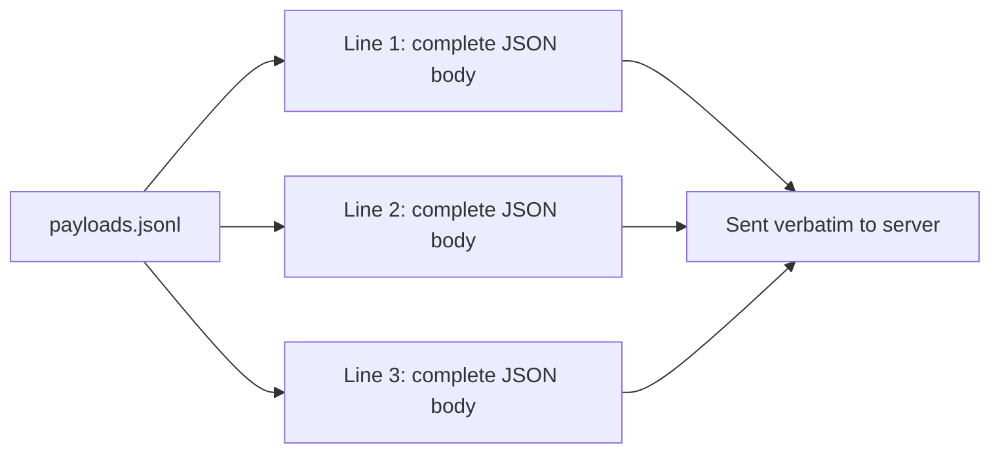
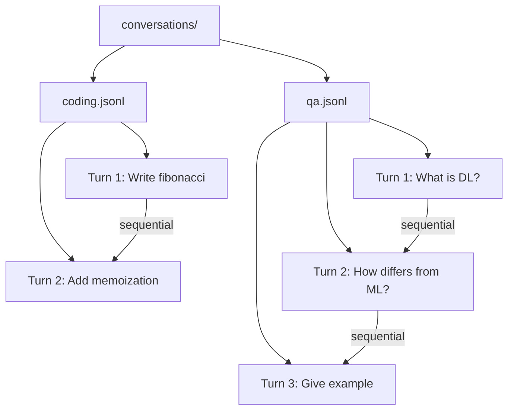

<!--
SPDX-FileCopyrightText: Copyright (c) 2025-2026 NVIDIA CORPORATION & AFFILIATES. All rights reserved.
SPDX-License-Identifier: Apache-2.0
-->

# Raw Payload Replay

Benchmark by replaying complete API request bodies verbatim -- zero formatting, zero transformation.

## Overview

The `raw_payload` dataset type sends pre-built API request payloads directly to the inference server exactly as written. AIPerf skips all endpoint formatting and payload construction, making this ideal for:

- **Production traffic replay**: Capture real API calls and replay them identically
- **Pre-built payloads**: Use payloads exported from other tools (mitmproxy, API logs, etc.)
- **Full control**: Specify every field (messages, tools, temperature, etc.) exactly as needed
- **Multi-turn replay**: Replay multi-turn conversations from a directory of JSONL files

### Two Input Modes

| Mode | Input | Conversations | Use Case |
|------|-------|--------------|----------|
| **Single file** | One `.jsonl` file | Each line = one single-turn conversation | Independent requests |
| **Directory** | Folder of `.jsonl` files | Each file = one multi-turn conversation, lines = turns | Conversation replay |

## Single File Mode

Each line in the JSONL file is a complete API request body. Every line becomes an independent single-turn conversation.

### Preparing the Data

```bash
cat > payloads.jsonl << 'EOF'
{"messages": [{"role": "user", "content": "What is machine learning?"}], "model": "Qwen/Qwen3-0.6B", "max_tokens": 100}
{"messages": [{"role": "user", "content": "Explain neural networks."}], "model": "Qwen/Qwen3-0.6B", "max_tokens": 200}
{"messages": [{"role": "system", "content": "You are a math tutor."}, {"role": "user", "content": "What is 2+2?"}], "model": "Qwen/Qwen3-0.6B", "max_tokens": 50}
EOF
```

Each line is a complete JSON object that will be sent to the server as-is. You can include any fields the API accepts: `messages`, `model`, `max_tokens`, `temperature`, `tools`, `stream`, etc.

### Running the Benchmark

```bash
aiperf profile \
    --model Qwen/Qwen3-0.6B \
    --endpoint-type raw \
    --endpoint /v1/chat/completions \
    --input-file payloads.jsonl \
    --custom-dataset-type raw_payload \
    --streaming \
    --url localhost:8000 \
    --concurrency 2
```

### How It Works



## Directory Mode

Each `.jsonl` file in the directory represents one multi-turn conversation. Lines within a file are ordered turns, sent sequentially.

### Preparing the Data

```bash
mkdir -p conversations/

# Conversation 1: a two-turn coding session
cat > conversations/coding.jsonl << 'EOF'
{"messages": [{"role": "user", "content": "Write a Python fibonacci function."}], "model": "Qwen/Qwen3-0.6B", "max_tokens": 300}
{"messages": [{"role": "user", "content": "Write a Python fibonacci function."}, {"role": "assistant", "content": "def fib(n): ..."}, {"role": "user", "content": "Now add memoization."}], "model": "Qwen/Qwen3-0.6B", "max_tokens": 300}
EOF

# Conversation 2: a three-turn Q&A
cat > conversations/qa.jsonl << 'EOF'
{"messages": [{"role": "user", "content": "What is deep learning?"}], "model": "Qwen/Qwen3-0.6B", "max_tokens": 200}
{"messages": [{"role": "user", "content": "What is deep learning?"}, {"role": "assistant", "content": "Deep learning is..."}, {"role": "user", "content": "How does it differ from ML?"}], "model": "Qwen/Qwen3-0.6B", "max_tokens": 200}
{"messages": [{"role": "user", "content": "What is deep learning?"}, {"role": "assistant", "content": "Deep learning is..."}, {"role": "user", "content": "How does it differ from ML?"}, {"role": "assistant", "content": "The key differences..."}, {"role": "user", "content": "Give me an example."}], "model": "Qwen/Qwen3-0.6B", "max_tokens": 200}
EOF
```

### Running the Benchmark

```bash
aiperf profile \
    --model Qwen/Qwen3-0.6B \
    --endpoint-type raw \
    --endpoint /v1/chat/completions \
    --input-file conversations/ \
    --custom-dataset-type raw_payload \
    --streaming \
    --url localhost:8000 \
    --concurrency 2
```

### How It Works



- Files are processed in sorted order (alphabetical by filename)
- Only `.jsonl` files are loaded; other files are ignored
- Empty files are skipped
- Turns within a conversation execute sequentially; conversations run concurrently

## Use Cases

### Replaying Captured Traffic

If you have API call logs (e.g., from mitmproxy or application logging), convert them to JSONL and replay:

```bash
# Each line is one captured request body
cat > captured_traffic.jsonl << 'EOF'
{"messages": [{"role": "system", "content": "You are a helpful assistant."}, {"role": "user", "content": "Summarize this document..."}], "model": "Qwen/Qwen3-0.6B", "max_tokens": 500, "temperature": 0.7}
{"messages": [{"role": "user", "content": "Translate to French: Hello world"}], "model": "Qwen/Qwen3-0.6B", "max_tokens": 50, "temperature": 0.0}
EOF

aiperf profile \
    --model Qwen/Qwen3-0.6B \
    --endpoint-type raw \
    --endpoint /v1/chat/completions \
    --input-file captured_traffic.jsonl \
    --custom-dataset-type raw_payload \
    --streaming \
    --url localhost:8000 \
    --concurrency 4
```

### Payloads with Tools

Raw payloads can include tool definitions and any other API fields:

```bash
cat > tool_payloads.jsonl << 'EOF'
{"messages": [{"role": "user", "content": "What is the weather in Paris?"}], "model": "Qwen/Qwen3-0.6B", "max_tokens": 200, "tools": [{"type": "function", "function": {"name": "get_weather", "description": "Get weather", "parameters": {"type": "object", "properties": {"city": {"type": "string"}}}}}]}
EOF
```

## Key Points

- Payloads are sent **verbatim** -- AIPerf does not modify, validate, or reformat them
- The `--model` flag is still required for metrics reporting but does not override the `model` field in your payload
- Use `--endpoint-type raw` with `--endpoint <path>` to control the API path (e.g., `--endpoint /v1/chat/completions`)
- The `raw` endpoint has no built-in API path -- you must specify one via `--endpoint` or include it in the base URL
- Works with any API server, not just OpenAI-compatible ones
