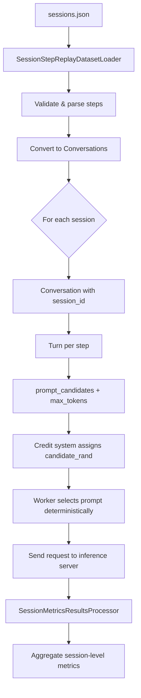

<!--
SPDX-FileCopyrightText: Copyright (c) 2026 NVIDIA CORPORATION & AFFILIATES. All rights reserved.
SPDX-License-Identifier: Apache-2.0
-->

# Session Step Replay Dataset

Benchmark LLM inference servers by replaying captured multi-step agent sessions with realistic prompt sequences, per-step token budgets, and session-level metrics.

## Overview

Many LLM-powered agents make multiple sequential calls to complete a task. Each call sends a self-contained prompt so there is no server-side conversation context between steps.

The session step replay loader replays these captured sessions against your inference server. Each session is a sequence of steps that execute sequentially, while multiple sessions run concurrently. This reproduces the traffic pattern of the original deployment and measures how your server handles it.

**Key features:**

- Replay captured agent sessions with realistic prompt sizes and token budgets
- Per-step `max_tokens` control matching the original workload
- Automatic session-level metrics: duration, turn count, throughput
- Multiple candidate prompts per step for workload variation
- Deterministic prompt selection with `--random-seed` for reproducible benchmarks

**When to use:**

- You have recorded LLM sessions and want to measure serving performance under the original traffic pattern
- You need session-level metrics (duration, throughput) alongside per-request metrics
- Each step in your workload is a self-contained prompt (no server-side context accumulation between steps)

---

## Dataset Format

Session step replay datasets are single JSON files. The top-level object maps session IDs to ordered lists of steps:

```json
{
    "session_a1b2c3": [
        {
            "candidate_prompts": ["<full prompt for step 1>"],
            "expected_output_tokens": 500,
            "expected_input_tokens": 2048,
            "step": 1
        },
        {
            "candidate_prompts": ["<full prompt for step 2>"],
            "expected_output_tokens": 750,
            "expected_input_tokens": 2800,
            "step": 2
        }
    ],
    "session_d4e5f6": [
        {
            "candidate_prompts": ["<full prompt for step 1>"],
            "expected_output_tokens": 300,
            "expected_input_tokens": 1500,
            "step": 1
        }
    ]
}
```

A typical dataset contains hundreds to thousands of sessions with varying numbers of steps. Input token counts may vary across steps, and output token budgets differ per step based on the expected response size.

### Step Fields

| Field | Required | Default | Description |
|-------|----------|---------|-------------|
| `candidate_prompts` | Yes | -- | List of prompt strings. One is randomly selected per request. |
| `expected_output_tokens` | No | 512 | `max_tokens` sent to the inference server for this step. |
| `expected_input_tokens` | No | `null` | Informational only. Not sent to the server. Useful for capacity planning. |
| `step` | No | `null` | Informational step number for debugging. |

> [!IMPORTANT]
> The file must use a `.json` extension (not `.jsonl`). The loader auto-detects session step replay format by validating that the file contains a JSON object mapping string keys to lists of step objects with `candidate_prompts`.

### Preparing Your Data

If you have LLM request logs, convert them to session step replay format:

1. Group requests by session ID
2. Order steps within each session
3. For each step, include the full prompt string in `candidate_prompts`
4. Set `expected_output_tokens` from the original `max_tokens` or actual completion length
5. Optionally set `expected_input_tokens` from the original prompt token count
6. Output as a JSON object keyed by session ID

---

## Server Setup

Start a vLLM server for testing:

```bash
docker pull vllm/vllm-openai:latest
docker run --gpus all -p 8000:8000 vllm/vllm-openai:latest \
  --model Qwen/Qwen3-0.6B \
  --host 0.0.0.0 --port 8000 &
```

Verify the server is ready:
```bash
curl -s http://localhost:8000/v1/completions \
  -H "Content-Type: application/json" \
  -d '{
    "model": "Qwen/Qwen3-0.6B",
    "prompt": "Hello",
    "max_tokens": 10
  }' | jq
```

---

## Basic Usage

```bash
aiperf profile \
    --model Qwen/Qwen3-0.6B \
    --endpoint-type completions \
    --input-file sessions.json \
    --custom-dataset-type session_step_replay \
    --url localhost:8000 \
    --concurrency 100 \
    --random-seed 42
```

**Key points:**

- `--custom-dataset-type session_step_replay` activates the session step replay loader
- `--endpoint-type completions` is the typical endpoint (each step is a standalone prompt)
- `--concurrency` controls how many sessions run in parallel, matching your deployment's expected load
- Steps within a session always execute sequentially (step 1 completes before step 2 starts)
- `--random-seed 42` ensures deterministic prompt candidate selection across runs

### Controlling Scale

Use `--num-sessions` to limit how many sessions are replayed from the dataset:

```bash
# Quick smoke test with 10 sessions
aiperf profile \
    --model Qwen/Qwen3-0.6B \
    --endpoint-type completions \
    --input-file sessions.json \
    --custom-dataset-type session_step_replay \
    --url localhost:8000 \
    --num-sessions 10 \
    --concurrency 10
```

---

## Session-Level Metrics

Session step replay automatically computes four additional metrics beyond the standard per-request metrics:

| Metric | Description | Unit |
|--------|-------------|------|
| **Session Duration** | Time from first request start to last request end per session | ms |
| **Session Turns** | Number of request-response steps per session | count |
| **Session Count** | Total number of completed sessions | count |
| **Session Throughput** | Sessions completed per second over the benchmark duration | sessions/sec |

Session duration and turns report per-session statistics (avg, min, max, p99, p50). Session count and throughput are scalar aggregates.

These metrics capture the end-user experience: a session must complete all its steps before delivering a final result, so session duration is often the most important metric for user-facing latency.

---

## Candidate Prompt Selection

Each step can have multiple `candidate_prompts`. This is useful when you have multiple prompt variants and want to benchmark them under identical conditions:

```json
{
    "candidate_prompts": [
        "<prompt variant A for this step>",
        "<prompt variant B for this step>"
    ],
    "expected_output_tokens": 512
}
```

Selection is deterministic when using `--random-seed`. The random value is generated once per credit issuance and travels with the request, so the same seed produces the same prompt selection regardless of which worker processes the request or how many concurrent workers are running.

In practice, most recorded datasets have one candidate per step (the exact prompt from the original session). Multiple candidates are primarily useful when comparing prompt variants.

---

## Use Cases

### Replaying Production Traffic

Capture LLM requests from your deployment, preprocess them into session step replay format, and replay against a new serving configuration. This lets you measure real throughput and latency impact before deploying changes.

```bash
# Baseline: current serving config
aiperf profile \
    --model my-model \
    --endpoint-type completions \
    --input-file production_sessions.json \
    --custom-dataset-type session_step_replay \
    --url http://baseline-server:8000/v1 \
    --concurrency 200 \
    --random-seed 42

# Candidate: new config (different batch size, quantization, etc.)
aiperf profile \
    --model my-model \
    --endpoint-type completions \
    --input-file production_sessions.json \
    --custom-dataset-type session_step_replay \
    --url http://candidate-server:8000/v1 \
    --concurrency 200 \
    --random-seed 42
```

### Capacity Planning

Vary `--concurrency` to find the breaking point:

```bash
for c in 50 100 200 500 1000; do
    aiperf profile \
        --model my-model \
        --endpoint-type completions \
        --input-file sessions.json \
        --custom-dataset-type session_step_replay \
        --url localhost:8000 \
        --concurrency $c \
        --random-seed 42 \
        --output-artifact-dir "artifacts/concurrency-${c}"
done
```

Compare session duration and throughput across runs to identify where latency degrades.

---

## How It Works



1. **Load**: The loader reads the JSON file and validates each session and its steps.
2. **Convert**: Each session becomes a `Conversation` with a unique `session_id`. Each step becomes a `Turn` carrying `prompt_candidates` and `max_tokens`.
3. **Schedule**: Sessions are shuffled and dispatched concurrently. Steps within a session execute sequentially.
4. **Select**: When a worker picks up a request, it uses the credit-issued `candidate_rand` value to deterministically select one prompt from `prompt_candidates`.
5. **Execute**: The selected prompt is sent to the inference server with the step's `expected_output_tokens` as `max_tokens`. Each step is a standalone completion request with no conversation history.
6. **Measure**: The session metrics processor groups completed requests by session ID and computes duration, turn count, session count, and session throughput.

### Difference from Multi-Turn

Session step replay and multi-turn (`multi_turn`) both execute sequential requests within a session, but they differ in a key way:

| | Session Step Replay | Multi-Turn |
|---|---|---|
| **Context** | Each step is self-contained. The prompt includes all necessary context. | Each turn sends the full conversation history (prior user + assistant messages). |
| **Endpoint** | Typically `completions` | Typically `chat` |
| **Server state** | No server-side conversation state | Server accumulates message history |
| **Prompt construction** | Prompts are pre-built (from captured data) | Framework appends prior messages automatically |

Use session step replay when each step's prompt is already complete. Use multi-turn when you need the framework to accumulate conversation history.

---

## Quick Reference

| Parameter | Value |
|-----------|-------|
| `--input-file` | Path to `.json` session step replay file |
| `--custom-dataset-type` | `session_step_replay` |
| `--endpoint-type` | `completions` (typical) or `chat` |
| `--concurrency` | Max concurrent sessions |
| `--random-seed` | Deterministic prompt candidate selection |
| `--num-sessions` | Limit number of sessions to replay |
