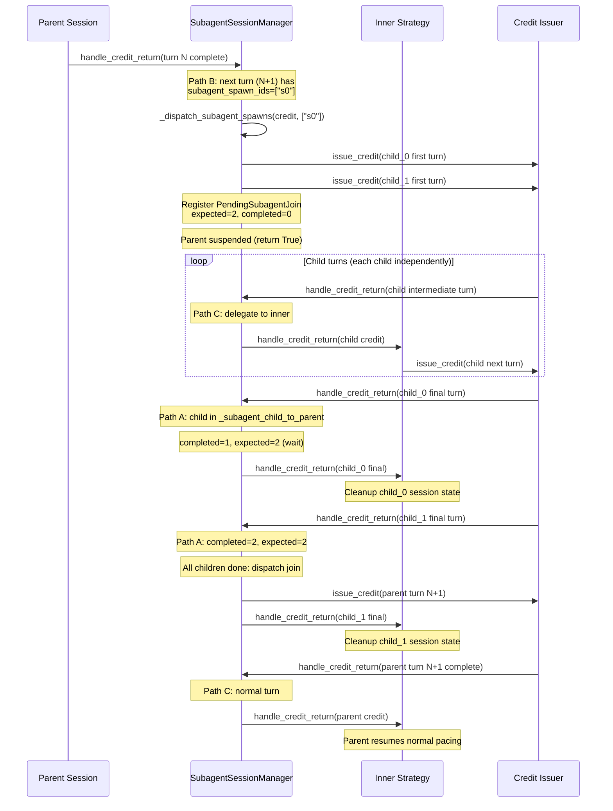

<!--
SPDX-FileCopyrightText: Copyright (c) 2026 NVIDIA CORPORATION & AFFILIATES. All rights reserved.
SPDX-License-Identifier: Apache-2.0
-->

# Subagent Session Management

Benchmark hierarchical agentic coding sessions where a parent agent spawns child subagents that run as independent conversations with their own KV caches.

## Overview

Modern agentic coding tools (Claude Code, Cursor, Copilot) spawn child agents during a session. A parent agent working on a feature might spawn a child to explore a codebase, another to run tests, and a third to plan a refactoring. Each child has its own conversation with the LLM server, its own system prompt, its own tool set, and its own KV cache blocks.

AIPerf models this with **subagent sessions**: parent conversations declare spawn points that start child conversations, then either wait for the children to finish (blocking) or continue immediately (background). This creates a tree of concurrent requests that stresses the server's KV cache management, scheduling, and memory allocation in ways that flat concurrent sessions do not.

Subagent sessions appear in three places:

| Source | How subagents are defined |
|---|---|
| **Synthetic coding sessions** (`--coding-session`) | Generated probabilistically using `--coding-session-subagent-*` parameters |
| **Coding traces** (kv-cache-tester JSON) | Extracted from nested `requests` arrays in trace files |
| **Claude Code traces** (JSONL) | Linked via `_manifest.json` declaring parent/child file relationships |

---

## Spawn Types

### Blocking Spawns

The parent pauses at the spawn turn and does not resume until **all** blocking children complete their final turn. The parent then continues at the **join turn** (the turn whose `subagent_spawn_ids` lists the spawn).

```
Parent:  T0 -> T1 -> T2 -> [spawn s0] ... waiting ... -> T3 (join) -> T4
                                |                            ^
Child A:                     C0 -> C1 -> C2 (final) --------+
Child B:                     C0 -> C1 (final) ---------------+
```

Blocking is the default. In `SubagentSpawnInfo`, `is_background` defaults to `False`.

### Background Spawns

The parent continues immediately after spawning children. Children run independently and are not tracked for join accounting. The parent processes its next turn with the normal delay, as if no spawn occurred.

```
Parent:  T0 -> T1 -> T2 -> [spawn s0] -> T3 -> T4 -> T5
                                |
Child A:                     C0 -> C1 -> C2 (runs independently)
```

Background spawns are controlled by `--coding-session-subagent-background-probability` (default `0.15`) for synthetic sessions, or `is_background: true` in Claude Code manifests.

At the `SubagentSessionManager` level, background children are never registered in the `_subagent_child_to_parent` mapping. This has two consequences:

1. **`_dispatch_subagent_spawns` returns `False`** when all spawns are background, so the parent falls through to Path C and the inner strategy handles the next turn with normal delay logic.
2. **Background children's final turns bypass Path A entirely.** When a background child completes, its correlation ID is not in `_subagent_child_to_parent`, so `handle_credit_return` skips Path A. Since it is a final turn, Path B is also skipped. The inner strategy receives the credit through Path C and performs normal cleanup (evicting hash IDs, removing per-session state) without any join accounting.

---

## Data Model

### SubagentSpawnInfo

Each parent `Conversation` carries a list of `subagent_spawns`, where each entry describes one spawn event:

```python
class SubagentSpawnInfo(AIPerfBaseModel):
    spawn_id: str                       # e.g. "s0", "s1"
    child_conversation_ids: list[str]   # IDs of child Conversations to start
    join_turn_index: int                # Parent turn index to resume after children complete
    is_background: bool = False         # If true, parent continues without waiting
```

### Turn Annotations

The parent turn at `join_turn_index` carries `subagent_spawn_ids` listing which spawns must complete before that turn executes:

```python
class Turn(AIPerfBaseModel):
    subagent_spawn_ids: list[str] = []  # e.g. ["s0"] or ["s0", "s1"]
    # ... other fields
```

This is also propagated through `TurnMetadata.subagent_spawn_ids` for use by timing strategies.

### Child Conversations

Child conversations are full `Conversation` objects with `agent_depth > 0`:

- `agent_depth=0`: root (parent) session
- `agent_depth=1`: child subagent
- `agent_depth=2`: grandchild (child of a child)

Children have independent `hash_ids`, their own tool definitions, and shorter context windows than parents.

### ConversationMetadata

The `ConversationMetadata` passed to timing strategies includes `subagent_spawns` and `agent_depth`, so the timing layer can intercept spawn/join events without needing access to the full conversation data.

---

## How Loaders Produce Subagent Data

### Synthetic Coding Sessions (CodingSessionComposer)

When `--coding-session` is enabled, the `CodingSessionComposer` generates subagent children using a two-level probability model:

1. **Session level**: `--coding-session-subagent-session-probability` (default `0.35`) decides whether a session uses subagents at all.
2. **Turn level**: `--coding-session-subagent-turn-probability` (default `0.25`) is the per-turn spawn probability, conditional on the session using subagents.

Each spawn selects a subagent type profile (Explore, General, or Plan) by weighted random choice, then generates 1 to `--coding-session-subagent-count-max` (default `4`) children using a Poisson distribution with mean `--coding-session-subagent-count-mean` (default `1.2`).

**Subagent type profiles** determine child session characteristics:

| Type | Weight | System Tokens | Turns (mean/median) | New Tokens (mean/median) | Max Prompt | Tools |
|---|---|---|---|---|---|---|
| **Explore** | 0.50 | 12,000 | 5/4 | 2,000/1,000 | 30,000 | read_file, search_files, list_directory, run_command |
| **General** | 0.35 | 20,000 | 10/7 | 3,000/1,500 | 80,000 | read_file, edit_file, search_files, run_command, list_directory, write_file, find_references, get_diagnostics |
| **Plan** | 0.15 | 15,000 | 4/3 | 2,500/1,200 | 50,000 | read_file, search_files, list_directory, run_command, find_references |

The `--coding-session-subagent-explore-model-name` option allows routing Explore subagents to a different (typically smaller) model.

Child conversations get independent L1 hash IDs at an offset (`2^30 * depth`) so they share zero KV cache blocks with the parent, matching real behavior where subagents have different tool definitions.

### Coding Traces (CodingTraceLoader)

Coding traces in kv-cache-tester JSON format encode subagents as nested `requests` arrays:

```json
{
  "id": "trace_001",
  "requests": [
    {"t": 0.0, "type": "s", "in": 8000, "out": 500, "hash_ids": [1, 2, 3]},
    {"t": 1.2, "type": "s", "in": 12000, "out": 800, "hash_ids": [1, 2, 3, 4],
     "requests": [
       {"t": 0.0, "type": "s", "in": 4000, "out": 200, "hash_ids": [100, 101],
        "requests": [
          {"t": 0.0, "type": "s", "in": 2000, "out": 100, "hash_ids": [200, 201]}
        ]
       },
       {"t": 0.5, "type": "s", "in": 5000, "out": 300, "hash_ids": [102, 103]}
     ]
    },
    {"t": 5.0, "type": "s", "in": 15000, "out": 600, "hash_ids": [1, 2, 3, 4, 5]}
  ]
}
```

The loader extracts subagent subtrees using `_extract_subagent_subtrees()`:

- A child request with its own nested `requests` is identified as a subagent subtree.
- Leaf children (no nested requests) are flattened inline into the parent's request sequence.
- Subtree children become separate `Conversation` objects with `agent_depth` set according to nesting depth.
- Grandchild subtrees are extracted recursively.

### Claude Code Traces (ClaudeCodeTraceLoader)

Claude Code JSONL traces use a `_manifest.json` file to declare parent/child relationships:

```json
{
  "parent": "session_abc.jsonl",
  "subagents": [
    {"file": "subagent_001.jsonl", "spawn_after_api_call": 3, "is_background": false},
    {"file": "subagent_002.jsonl", "spawn_after_api_call": 3, "is_background": true},
    {"file": "subagent_003.jsonl", "spawn_after_api_call": 7, "is_background": false}
  ]
}
```

Each `ClaudeCodeSubagentLink` specifies:

- `file`: the JSONL filename for the child session
- `spawn_after_api_call`: 0-based index of the parent API call after which this subagent spawns
- `is_background`: whether the parent waited for this child

The loader converts these into `SubagentSpawnInfo` entries on the parent conversation and sets `agent_depth=1` on child conversations. The join turn index is `spawn_after_api_call + 1` (the next API call after the spawn point).

---

## The SubagentSessionManager

The `SubagentSessionManager` is a decorator that wraps any `TimingStrategyProtocol` implementation, intercepting spawn and join events while delegating everything else to the inner strategy. It does not replace the timing strategy; it adds subagent awareness on top.

### Three Paths

When a credit returns (a turn completes), the manager checks three paths in order:

**Path A -- Child final turn with known parent**: The child's correlation ID is in the `_subagent_child_to_parent` mapping. The manager increments the completion counter. If all blocking children for that parent are done, it dispatches the parent's join turn. Then it delegates to the inner strategy for cleanup.

**Path B -- Next turn has subagent spawns**: The next turn's metadata has `subagent_spawn_ids`. The manager fans out child sessions:
- For each spawn ID, looks up the `SubagentSpawnInfo` to get child conversation IDs.
- Starts each child session via `ConversationSource.start_child_session()`.
- Issues a first-turn credit for each child.
- If any spawn is blocking, registers a `PendingSubagentJoin` and suspends the parent (returns without delegating to inner).
- If all spawns are background, returns `False` so the parent falls through to the inner strategy's normal delay handling.

**Path C -- Everything else**: Delegates directly to the inner strategy.

### PendingSubagentJoin Tracking

```python
@dataclass(slots=True)
class PendingSubagentJoin:
    parent_conversation_id: str
    parent_correlation_id: str
    expected_count: int          # total blocking children across all spawn IDs
    completed_count: int = 0
    join_turn_index: int = 0
    parent_num_turns: int = 0
    parent_agent_depth: int = 0
```

When multiple spawn IDs appear on the same join turn (e.g., `["s0", "s1"]`), the `expected_count` is the sum of all blocking children across both spawns. A single `PendingSubagentJoin` tracks them all.

### Strategy Integration

The inner strategy can optionally implement `on_child_session_started(corr_id, depth, parent_corr_id)` to track child sessions. `AdaptiveScaleStrategy` uses this hook to record session depth for TTL-aware working set eviction: child sessions use `--coding-session-subagent-cache-ttl-sec` (default `300.0`) instead of the parent's `--coding-session-cache-ttl-sec` (default `3600.0`).

On child final turns, `AdaptiveScaleStrategy` cleans up per-session state (rate limit counts, backoffs, hash IDs) but does not decrement the active user count or trigger session recycling, since children are not "users."

---

## Recursive Nesting

Subagent children can spawn their own children (grandchildren). The synthetic composer supports this up to `--coding-session-max-subagent-depth` (default `1`, range `1` to `5`).

At each depth level, the effective spawn probability decays:

```
effective_prob = subagent_turn_probability * subagent_depth_spawn_decay ^ depth
```

With defaults (`subagent_turn_probability=0.25`, `subagent_depth_spawn_decay=0.5`):
- Depth 0 (parent spawning children): 25% per turn
- Depth 1 (child spawning grandchildren): 12.5% per turn
- Depth 2 (grandchild spawning great-grandchildren): 6.25% per turn

Each nested level gets independent L1 hash IDs at offset `2^30 * depth`, so caches never overlap across depth levels.

The `SubagentSessionManager` handles recursive nesting transparently because each child conversation is a full `Conversation` with its own `subagent_spawns` and `SubagentSpawnInfo` entries. When the child reaches a turn whose next turn has `subagent_spawn_ids`, Path B fires exactly as it does for the root parent: it calls `_dispatch_subagent_spawns`, creates a `PendingSubagentJoin` for the child, suspends the child, and fans out grandchildren. When the grandchild completes, Path A increments the child's join counter. When all grandchildren finish, the child's join turn is dispatched, resuming the child. Eventually the child itself completes, and its final turn triggers Path A for the root parent.

This means the join graph is a tree of independent `PendingSubagentJoin` entries, each tracking only its direct children. The root parent never directly observes grandchild completions -- those are handled by the intermediate child's own pending join.

---

## Multiple Spawns Per Join Turn

A single parent turn can trigger multiple spawn IDs simultaneously. For example, the parent might spawn both an Explore agent and a Plan agent at the same turn:

```python
# Turn 3 of the parent has subagent_spawn_ids=["s0", "s1"]
# s0 has 2 blocking children, s1 has 1 background child
```

The `SubagentSessionManager` processes all spawn IDs in a single `_dispatch_subagent_spawns()` call:

1. Iterates over each spawn ID in the list.
2. Fans out all children (blocking and background) issuing first-turn credits.
3. Counts only blocking children toward `expected_count`.
4. If any spawn is blocking, creates one `PendingSubagentJoin` with the total blocking count.
5. Background children run independently and are not tracked for join accounting.

Mixed blocking and background spawns on the same turn work correctly: the parent suspends until all blocking children finish, while background children run fire-and-forget.

---

## Full Lifecycle (Blocking Spawn)

This end-to-end walkthrough traces a single blocking spawn from the parent's perspective through child execution and back to the parent's resumption.



Key details:

1. **Parent suspension is implicit.** No explicit "pause" state exists. The parent simply has no pending credit. When `_dispatch_subagent_spawns` returns `True`, `handle_credit_return` returns without issuing the parent's next turn. The parent is effectively suspended because nothing will issue its next credit until the join condition is met.

2. **Child intermediate turns use Path C.** Only blocking children's **final** turns trigger Path A. Intermediate turns (where `is_final_turn` is False) skip Path A, skip Path B (children typically have no spawn IDs), and delegate directly to the inner strategy through Path C.

3. **Join dispatch is fire-and-forget.** The `PendingSubagentJoin` is removed, and a `TurnToSend` for the parent's join turn is issued through the credit issuer via `scheduler.execute_async`. The parent's turn then flows through the normal credit pipeline.

4. **Inner strategy cleanup happens on every child final turn.** Both the join accounting (Path A) and the inner strategy delegation happen sequentially in the same `handle_credit_return` call. The inner strategy (e.g., `AdaptiveScaleStrategy`) uses this to clean up per-session state (rate limit counts, backoffs, hash IDs) without decrementing the active user count or recycling the session slot.

---

## Practical Examples

### Synthetic Sessions with Subagents

Generate 100 coding sessions where 35% of sessions use subagents and each spawning turn has a 25% chance of spawning 1-4 children:

```bash
aiperf profile \
    --model claude-sonnet-4-20250514 \
    --endpoint-type chat \
    --streaming \
    --url localhost:8000 \
    --coding-session \
    --coding-session-num-sessions 100 \
    --coding-session-subagent-session-probability 0.35 \
    --coding-session-subagent-turn-probability 0.25 \
    --coding-session-subagent-count-mean 1.2 \
    --coding-session-subagent-count-max 4 \
    --coding-session-subagent-background-probability 0.15 \
    --timing-mode adaptive_scale \
    --adaptive-scale-start-users 5 \
    --adaptive-scale-max-users 50
```

### Disable Subagents Entirely

Set `--coding-session-subagent-session-probability 0.0` to generate flat sessions with no children:

```bash
aiperf profile \
    --model claude-sonnet-4-20250514 \
    --endpoint-type chat \
    --streaming \
    --url localhost:8000 \
    --coding-session \
    --coding-session-num-sessions 200 \
    --coding-session-subagent-session-probability 0.0 \
    --timing-mode adaptive_scale
```

### Route Explore Subagents to a Smaller Model

Use `--coding-session-subagent-explore-model-name` to send 50% of subagent work (Explore type) to a faster, smaller model:

```bash
aiperf profile \
    --model claude-sonnet-4-20250514 \
    --endpoint-type chat \
    --streaming \
    --url localhost:8000 \
    --coding-session \
    --coding-session-subagent-explore-model-name claude-haiku-4-5-20251001 \
    --timing-mode adaptive_scale
```

### Deep Nesting with Grandchildren

Allow children to spawn their own subagents up to 3 levels deep:

```bash
aiperf profile \
    --model claude-sonnet-4-20250514 \
    --endpoint-type chat \
    --streaming \
    --url localhost:8000 \
    --coding-session \
    --coding-session-max-subagent-depth 3 \
    --coding-session-subagent-depth-spawn-decay 0.5 \
    --timing-mode adaptive_scale
```

### Replay Claude Code Traces with Subagents

Given a directory of Claude Code JSONL session files with a `_manifest.json`:

```
traces/
  session_main.jsonl
  subagent_explore.jsonl
  subagent_test.jsonl
  _manifest.json
```

Where `_manifest.json` contains:

```json
{
  "parent": "session_main.jsonl",
  "subagents": [
    {"file": "subagent_explore.jsonl", "spawn_after_api_call": 5, "is_background": false},
    {"file": "subagent_test.jsonl", "spawn_after_api_call": 5, "is_background": true}
  ]
}
```

Replay with:

```bash
aiperf profile \
    --model claude-sonnet-4-20250514 \
    --endpoint-type chat \
    --streaming \
    --url localhost:8000 \
    --input-file traces/ \
    --timing-mode adaptive_scale
```

The loader detects the manifest, loads the parent and child sessions, and produces conversations with `SubagentSpawnInfo` annotations. The `SubagentSessionManager` handles the rest at runtime.

---

## Tips

- **Subagent children are excluded from the sampler.** Only root conversations (`agent_depth=0`) are sampled by the timing strategy. Children are started on demand when their parent reaches the spawn point.
- **Each child gets a unique correlation ID.** Even if the same child conversation is spawned multiple times (e.g., session recycling), each instance gets a fresh `x_correlation_id` for independent tracking.
- **Background children do not affect parent timing.** The parent processes its next turn with normal delay as if no spawn occurred. Background children complete independently and their final turns are handled by the inner strategy without join accounting.
- **Working set tracking respects depth.** `AdaptiveScaleStrategy` evicts child session hash IDs from the working set using the shorter `subagent_cache_ttl_sec` (default 300s) rather than the parent's `cache_ttl_sec` (default 3600s), matching real server behavior where subagent caches expire faster.
- **The SubagentSessionManager is strategy-agnostic.** It wraps any `TimingStrategyProtocol` implementation. If your custom strategy needs to know about child sessions, implement the optional `on_child_session_started(corr_id, depth, parent_corr_id)` hook.
- **Join turn index must be valid.** If `join_turn_index >= parent_num_turns`, the join is silently suppressed after all children complete. This prevents out-of-bounds errors when traces have truncated conversations.
- **Coding trace subagents are structural.** In kv-cache-tester JSON traces, any child request that has its own nested `requests` array is treated as a subagent subtree. Leaf children (no nesting) are flattened inline into the parent sequence.
